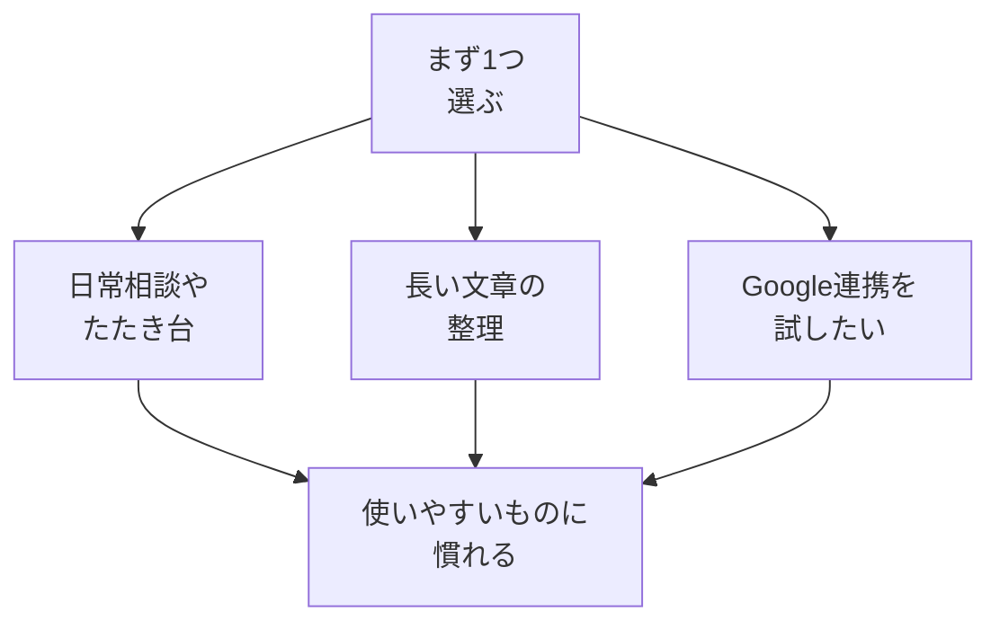

# ChatGPT・Claude・Geminiの違いをざっくり知る

## たとえ話

> 同じような道具が3つ店先に並んでいると、つい全部を見比べて、どれも決められないまま時間だけが過ぎてしまうことがある。それぞれに少しずつ得意があり、握り心地も違う。けれど、店先で説明書きを読み比べても、本当の違いは一度使ってみるまでわからない。多くの場合、まず1つ手に取って毎日使ううちに、自分に合うかどうかが見えてくる。
>
> AIのサービスを選ぶときも、これとよく似ている。名前が3つ並ぶと、どれが正解かを決めようとして、かえって手が止まりやすい。だが大切なのは「どれが一番優れているか」ではなく、「いまの自分が無理なく続けられる入口はどれか」だ。だから今日は、全部を見比べて疲れてしまう前に、ざっくりした違いを知り、まず使う1つを決めるところまで進む。1つに慣れてからほかを試す道は、いつでも残っているからだ。

## 今日のゴール

- 3サービスのざっくりした違いを理解し、4択チェック3問に答える。
- 自分がまず使う **1つ** を決める（アカウントがなくても「これからこれ」と決めるだけでOK）。

## この教材で伸ばす力

**判断する力** — 道具を比較し、自分の状況に合うものを選ぶ

## 学びの段階

完了条件は **「知った」** — 4択に答え、使うサービスを1つ決めたこと

## 前提確認

- すでにできる前提：生成AIの基本概念（01-what-is-genai）
- まだ知らなくてよいこと：API連携、有料プランの細かい違い

## なぜ大事か

「どれが正解」ではなく、「今の自分に合う入口はどれか」が大事です。
短い文案をスマホでさっと作りたいなら、手軽に使えるサービス。  
長い案内文のたたき台を整えたいなら、長文に強いサービスを試す。  
このように、自分のよくある作業に合わせて選びます。1つに慣れてから、必要なら他も試せばよいです。

## 読んで学ぶ

### 3サービス比較（2025年時点のざっくり目安）

| サービス | 提供元 | ざっくりした特徴 |
|---|---|---|
| **ChatGPT** | OpenAI | 知名度が高い。日常の相談・文案の入門向き |
| **Claude** | Anthropic | 長文の整理・丁寧な説明で使う人が多い |
| **Gemini** | Google | Googleアカウントと相性がよい。検索連携の機能あり |

※ 機能は更新されます。迷ったら **無料枠で1つ触ってみる** のが確実です。

### 選び方のヒント

1. すでに **Googleアカウント** を仕事で使っている → Gemini を試す  
2. 友人・Guildで **ChatGPT** を勧められた → ChatGPT から  
3. **長い資料** を読ませて整理したい → Claude を試す  

### 図解



## 手を動かす（5分）

1. 次のどれか1つを選び、メモに書く：
   - これからまず使う：ChatGPT / Claude / Gemini
2. 選んだ理由を1行（例：「Googleを使っているから」「友人が使っているから」）。

## わからないまま進まないチェック

- 「全部登録が必要？」→ 無料で始められるプランがあることが多い。個人情報は最小限に
- 「有料がいい？」→ 最初は無料で十分。慣れてから検討
- 「Cursorとの違いは？」→ Cursorはエディタ内のAI。第12章で扱う

## 4択チェック

1. 3サービスに共通することとして、いちばん近いのはどれですか？
   - A. どれも会話型の生成AIとして使える
   - B. どれも予約管理専用アプリ
   - C. どれもウイルス対策ソフト
   - D. どれもGitの代替

2. Googleアカウントを仕事でよく使う人が、まず試しやすいのはどれですか？
   - A. Gemini
   - B. どれもGoogle専用
   - C. どれも使えない
   - D. 紙のノートのみ

3. 第11章でのおすすめの進め方として、いちばん近いのはどれですか？
   - A. 3つ全部を毎日使い分ける
   - B. まず1つに慣れ、必要なら他も試す
   - C. どれも使わず検索だけ
   - D. AIに全部任せる

答え合わせはこちら：  
[答えを見る](../../答え/第11章-汎用AI活用/02-ChatGPT・Claude・Geminiの違い-答え.md)

## できたらOK

- [ ] 3問に答えた
- [ ] 答えページで確認した
- [ ] まず使うサービスを1つ決めた

## つまずいたら

### 躓いたら戻る先

- [01-what-is-genai](./01-生成AIとは何か.md)

```text
【今やっている教材】第11章 02-chatgpt-claude-gemini

【詰まったところ】

【試したこと】

【どうなればOKか】4択に答え、使う1つを決めればOK
```

## 今日の成果物

- 「まず使うAI：〇〇」の1行メモ

## 問い

選んだサービスで、**最初に相談してみたいテーマ**は何でしょうか。1行で書いてみてください。
