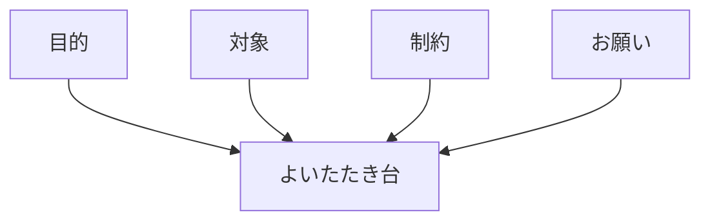

# プロンプトの基本 — AIへのお願い文

## たとえ話

> 「何か買ってきて」とだけ頼まれて店に着くと、何を選べばいいのか途方に暮れてしまう。予算も、誰が食べるのかも、いつ使うのかもわからないからだ。逆に「夕飯用に、辛くないカレールーをひと箱、300円くらいで」と頼まれれば、迷わず棚へ向かえる。同じ「買ってきて」でも、頼み方ひとつで、戻ってくるものはまるで変わる。
>
> AIへのお願いも、これとよく似ている。ひと言だけ投げると、相手は何を選べばいいかわからず、当たり障りのない答えを返してくる。目的・相手・守ってほしいことを少し添えるだけで、戻ってくる案はぐっと近づく。だから今日は、特別な呪文を覚えるのではなく、頼みごとを伝わる形に整える「型」を一度書いてみる。うまく頼めること自体が、これから先ずっと効いてくる力になるからだ。

## 今日のゴール

- 基本の型でプロンプトを1本書き、AIに送って回答を得る。

## この教材で伸ばす力

**相談する力** — 欲しい答えの形を言葉にして頼む

## 学びの段階

完了条件は **「できる」** — 指定の型でプロンプトを送り、回答をコピーまたはメモに残したこと

## 前提確認

- すでにできる前提：使うAIを1つ決めた（02-chatgpt-claude-gemini）。第7章のコンテキスト4項目
- まだ知らなくてよいこと：連鎖プロンプト、システムプロンプト

## なぜ大事か

同じAIでも、お願いの書き方で出力は大きく変わります。
プロンプトは魔法の呪文ではなく、**うまく頼むための型** です。

## 読んで学ぶ

### 基本の型（今日の新概念）

```
【目的】何のため？
【対象】誰向け？
【制約】文字数・トーン・やってはいけないこと
【お願い】具体的に何をしてほしい？
```

### 図解



## 手順

### 1. AIを開く

1. 02で決めたサービス（ChatGPT / Claude / Gemini）をブラウザで開く。
2. 新しいチャットを始める。

### 2. プロンプトを書く（お店の例）

次を **そのままコピーして送ってもよい** です。店名などは架空でOK。

```
【目的】春のキャンペーン用のInstagram投稿文のたたき台
【対象】30代女性・リピーター向け
【制約】200字以内、絵文字は2つまで、価格の具体的数字は入れない
【お願い】キャッチーな見出し1行と、本文3行を提案してください
```

### 3. もう一つの例（体験・お試しの案内）

```
【目的】サービスのお試し体験の案内文のたたき台
【対象】はじめて利用する方とそのご家族
【制約】300字以内、丁寧語、日時は「3月第2土曜 14:00〜」と仮置き
【お願い】タイトル1行と、本文を箇条書き3項目で提案してください
```

### 4. 回答を残す

1. 返ってきた文を、メモ帳または `Rebuild練習用` に `prompt-practice.txt` として保存（任意）。
2. 「そのまま使えるか？」を自分で1行評価する（例：「トーンは近いが、もう少し短くしたい」）。

> **個人情報注意**：実在のお客さまの名前・電話番号・住所は入れない。

## わからないまま進まないチェック

- 「英語の方がいい？」→ 日本語で十分。日本語で指示し、日本語で答えてもらう
- 「長すぎて怖い」→ 4行の型だけ使えばOK
- 「答えが微妙」→ 失敗も材料。次の教材でコンテキストを足す

## できたらOK

- [ ] 4項目の型でプロンプトを送った
- [ ] 回答が返ってきた
- [ ] 使えるかどうか1行で評価した

## つまずいたら

### 躓いたら戻る先

- [第7章：AIに渡す情報設計](../../第07章-AI情報設計/)
- [02-chatgpt-claude-gemini](./02-ChatGPT・Claude・Geminiの違い.md)

```text
【今やっている教材】第11章 03-prompt-basics

【詰まったところ】

【試したこと】

【どうなればOKか】プロンプトを送り回答が返ればOK
```

## 今日の成果物

- 送ったプロンプトと、AIの回答（コピーまたはスクショ）

## 問い

回答のうち、**そのまま使えそうな部分**と、**直したい部分**を1つずつ書いてみてください。
