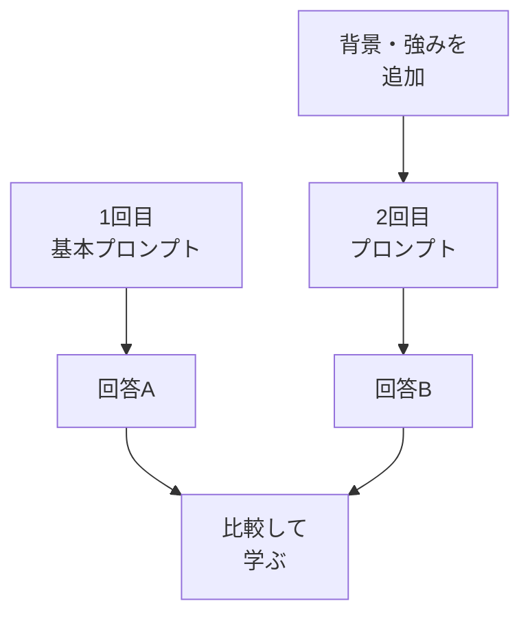

# コンテキストを足して回答を改善する

## たとえ話

> 旅先で「家族へのおみやげを選んでおいて」と人に頼むと、たいていは無難で当たり障りのない品が返ってくる。相手はその家族の好みも、家にもう何があるかも知らないからだ。けれど「甘いものが苦手で、温かい飲み物が好き」とひと言伝えておくだけで、選ばれる品はぐっとその人らしくなる。情報が増えるほど、選び方は的を射ていく。
>
> AIに案を頼むときも、これとよく似ている。背景を渡さなければ、相手はどこにでもありそうな、無難な答えを返すしかない。あなたの仕事の雰囲気や、大切にしていること、避けたい言い方を言葉にして渡すと、たたき台は一気に近づく。だから今日は、同じお願いに背景を足して、一度目と二度目の答えを並べてみる。何を渡すと何が変わるのかを、自分の目で確かめておくためだ。

## 今日のゴール

- 03のプロンプトに **背景** と **参考情報** を足し、もう一度AIに送って比較する。

## この教材で伸ばす力

**試行錯誤する力** — 1回目と2回目を比べ、改善を自分で判断する

## 学びの段階

完了条件は **「できる」** — コンテキスト追加前後の2つの回答を比較し、違いを1行で書いたこと

## 前提確認

- すでにできる前提：03-prompt-basics で1回プロンプトを送った
- まだ知らなくてよいこと：ファイルアップロードの細かい操作（サービスにより異なる）

## なぜ大事か

AIはあなたのお店の空気を知りません。
**雰囲気・強み・避けたい表現** を言葉で渡すと、たたき台の精度が上がります。
第6章で整理した資料の要点を写す練習にもつながります。

## 読んで学ぶ

### 足すコンテキストの例

| 項目 | 例 |
|---|---|
| 背景 | 落ち着いた雰囲気で、ていねいな対応を大切にしている |
| 強み | 一人ひとりに合わせたきめ細かいフォロー |
| 避けたいこと | 「激安」「最安値」のような安さだけの訴求 |

### 図解



## 手順

### 1. 1回目の回答を手元に用意

03で得た回答を開くか、覚えている内容を確認。

### 2. 背景メモを3行書く

メモ帳に、架空でもよいので次のような3行を書く（自分の仕事に合わせて言葉を変える）：

```
・店内は落ち着いた雰囲気で、ていねいな対応を大切にしている
・得意なのは一人ひとりに合わせたきめ細かい対応
・「激安」「最安値」のような安さだけの言葉は使いたくない
```

### 3. 2回目のプロンプトを送る

03のプロンプトの **下に** 次を足して送る：

```
【追加の背景】
（上で書いた3行を貼る）

【お願い】
先ほどと同じ条件で、もう一度案を出してください。背景を反映した言い回しにしてください。
```

### 4. 比較する

1. 1回目と2回目の回答を並べて読む。
2. メモに1行書く：
   ```
   2回目の方が〇〇が近くなった / まだ△△が足りない
   ```

### 5. 個人情報チェック

- お客さまの実名、電話、住所、お客さまの記録の内容は **入れていないか** 最後に確認。

## わからないまま進まないチェック

- 「1回目のチャットがない」→ 03からやり直すか、同じプロンプトを新規チャットで再送
- 「あまり変わらない」→ 背景をもっと具体的に（数字・雰囲気の形容詞）
- 「ファイルを添付したい」→ サービスによって可能。今日はテキストで十分

## できたらOK

- [ ] 背景3行を書いた
- [ ] 2回目のプロンプトを送った
- [ ] 1回目と2回目の違いを1行で書いた

## つまずいたら

### 躓いたら戻る先

- [第7章：AIに渡す情報設計](../../第07章-AI情報設計/)
- [03-prompt-basics](./03-プロンプトの基本.md)

```text
【今やっている教材】第11章 04-add-context

【詰まったところ】

【試したこと】

【どうなればOKか】2回比較して違いを1行書ければOK
```

## 今日の成果物

- 比較メモ1行＋2回分の回答（保存任意）

## 問い

コンテキストを足すと、**いちばん変わったのはトーン・長さ・内容のどれ**だったでしょうか。
