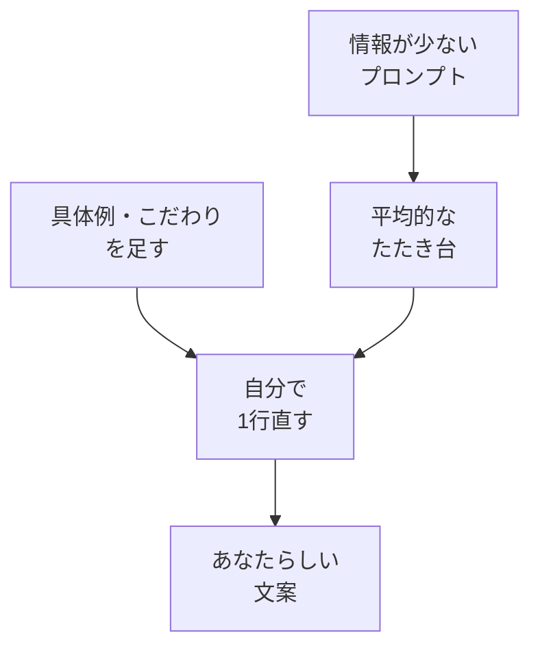

# 平均的な回答を超える考え方

## たとえ話

> スーパーの出来合いのお惣菜は、よくできている。誰が食べてもそこそこおいしく、大きな外れはない。けれど、そのまま食卓に並べても「いつもの味」にはならない。薬味を少し足す、器を変える、家の味付けをひとさじ加える——そのひと手間で、はじめて「うちの一皿」になる。無難さは出発点であって、ゴールではない。
>
> AIが返してくる案も、これとよく似ている。多くの人に当てはまる、無難で平均的なところに着地しやすい。それは下ごしらえとしては役に立つが、そのまま出せば、よそと同じ顔になってしまう。あなたの仕事の強みは、あなたにしかない具体的な経験やこだわりの中にある。だから今日は、平均的な答えがなぜ生まれるのかを知り、そこに自分のひと手間を加える方法を一つ持ち帰る。

## 今日のゴール

- 「平均的な答え」が出やすい理由を理解し、4択チェック3問に答える。
- 平均を超えるための **自分の一手** を1つ書く。

## この教材で伸ばす力

**正しく考える力** — 当たり障りのない答えを、自分の仕事向けに磨く

## 学びの段階

完了条件は **「知った」** — 4択に答え、「平均を超える一手」を1行書いたこと

## 前提確認

- すでにできる前提：03・04でプロンプトとコンテキストを試した
- まだ知らなくてよいこと：高度なペルソナ設計

## なぜ大事か

そのまま投稿すると、競合と同じような言葉になりがちです。
小規模事業の強みは **あなた固有の物語** にあります。
AIはその素材を並べる手伝い。最後の味付けは人間の仕事です。

## 読んで学ぶ

### なぜ平均的になりやすいか

- 学習データに多い表現が選ばれやすい  
- 情報が少ないと、安全で一般的な言い回しになる  
- AIは「あなたの店の一番のこだわり」を知らない  

### 平均を超える3つの一手

1. **具体例を1つ入れる** — 「〇〇のお客様に好評だった△△」は架空でもよいが具体的に  
2. **比較を頼む** — 「一般的な案と、差別化した案を2パターン」  
3. **自分で1行直す** — キャッチだけ手で書き換える  

### 図解



## 手を動かす（5分）

次の **一手** から1つ選び、メモに書く：

- 今後プロンプトに必ず入れる具体例：＿＿＿＿
- 今後AIに頼むときの比較依頼：「A案とB案を出して」
- 今日の回答で手で直す1行：＿＿＿＿

## わからないまま進まないチェック

- 「平均＝悪い？」→ たたき台としては有用。仕事で使う前に磨く
- 「具体例がない」→ 架空のエピソードでよい。実在のお客さまの名前は使わない

## 4択チェック

1. AIの回答が「どこにでもありそう」に感じる主な理由として、いちばん近いのはどれですか？
   - A. AIが故意に悪い答えをする
   - B. 一般的なパターンの答えが出やすいから
   - C. 日本語が苦手だから
   - D. 無料版だから

2. 平均を超えるために、Guildがまず勧めるのはどれですか？
   - A. プロンプトを空にする
   - B. 具体例・こだわりを足し、自分で直す
   - C. 答えを確認せず投稿する
   - D. 顧客の本名を入れる

3. 「2パターン出して」と頼む利点として、いちばん近いのはどれですか？
   - A. 必ず正解が1つになる
   - B. 一般的な案と差別化案を比べられる
   - C. 文字数が半分になる
   - D. 個人情報が不要になる

答え合わせはこちら：  
[答えを見る](../../答え/第11章-汎用AI活用/05-平均的な回答を超える考え方-答え.md)

## できたらOK

- [ ] 3問に答えた
- [ ] 答えページで確認した
- [ ] 「平均を超える一手」を1行書いた

## つまずいたら

### 躓いたら戻る先

- [04-add-context](./04-コンテキストを足して回答を改善する.md)
- [第2章：学びの土台](../../第02章-学びの土台/)

```text
【今やっている教材】第11章 05-beyond-average

【詰まったところ】

【試したこと】

【どうなればOKか】4択に答え、一手を1行書ければOK
```

## 今日の成果物

- 「平均を超える一手」メモ1行

## 問い

あなたの仕事の **いちばんのこだわり** を、AIに渡すならどんな1文で書くでしょうか。
