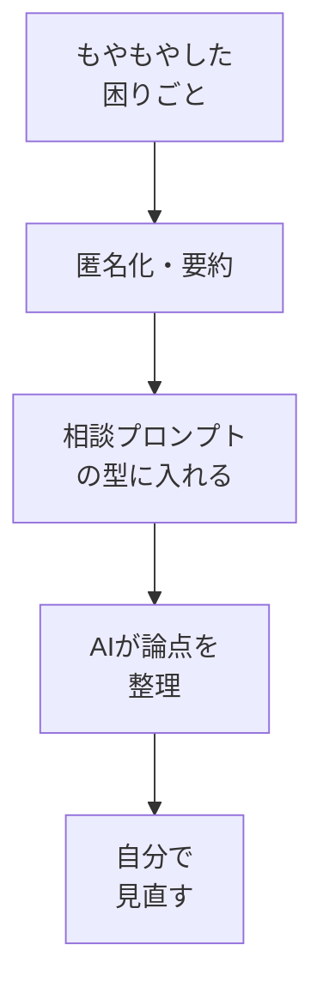

# 業務の困りごとをAIに相談する

## たとえ話

> 仕事で何かに行き詰まったとき、誰かに話を聞いてもらうだけで頭が整理されることがある。相手は特別な専門家でなくてもいい。「最近こういうことで困っていて」と声に出すうちに、もやもやしていた悩みの形がはっきりしてきて、「あ、本当に困っているのはここか」と自分で気づく。相手の答えそのものより、話す過程で考えがほどけていくことのほうが、ときに大きい。

> AIへの相談も、これとよく似ている。正解を出してもらう機械というより、考えを整理する相手として使うと力を発揮する。ただし、相手は自分の仕事の事情を何も知らない。だから今日は、自分の困りごとを「相談できる形」に整えてから渡す練習をする。困りごとを言葉にする力そのものが、AIを使わない場面でもずっと効いてくるからだ。

## 今日のゴール

- 自分の仕事の困りごとを1つ選び、匿名化したうえでAIに相談し、整理された返答を受け取る。

## この教材で伸ばす力

**相談する力** — もやもやした困りごとを、人にもAIにも伝わる形に整える

## 学びの段階

完了条件は **「できる」** — 困りごとを相談プロンプトにまとめて送り、返ってきた整理メモを残したこと

## 前提確認

- すでにできる前提：03でプロンプトの型、04でコンテキストの足し方を試した。第7章で機密情報を入れない考え方
- まだ知らなくてよいこと：複数回の深掘り対話（次の07で扱う）

## なぜ大事か

困りごとは、頭の中にあるうちは輪郭がぼやけています。
AIに相談すると、**論点を分けて並べ直す** 手伝いをしてくれるので、自分でも気づかなかった原因が見えやすくなります。
ただしAIは事情を知らないので、渡し方しだいで答えの質が大きく変わります。

## 読んで学ぶ

### 相談する前に「匿名化」する

第7章で学んだ通り、お客さまの実名・電話番号・住所、自分の事業の機密にあたる数字はそのまま入れません。
**要約して、固有名詞をぼかす** だけで、相談の役には十分立ちます。

| そのまま入れない | 言い換えた相談用の書き方 |
|---|---|
| 田中様からのクレーム内容 | あるお客さまからの、対応への不満 |
| 売上◯◯円・原価◯◯円 | 利益が思ったより残らない状況 |
| スタッフAさんとの揉めごと | 一緒に働く人との連携のずれ |

### 相談プロンプトの型

```
【相談したいこと】今いちばん困っていること（匿名化して1〜3行）
【背景】どんな仕事か・いつ起きるか（固有名詞は避ける）
【私が望む状態】どうなったら解決と言えるか
【お願い】原因の候補と、考える観点を整理してください。今すぐの結論は不要です
```

### 図解



## 手順

### 1. 困りごとを1つ選ぶ

1. 今の仕事で気になっていることを、メモ帳に思いつくまま書き出す。
2. その中から、今日相談する1つに丸をつける。

### 2. 匿名化する

1. 選んだ困りごとから、実名・電話・住所・具体的な金額を消す。
2. 「あるお客さま」「一緒に働く人」のように、ぼかした言い方に直す。

### 3. 相談プロンプトを送る

使うAI（02で決めたもの）を開き、次の型をコピーして埋め、送る：

```
【相談したいこと】予約や問い合わせへの返信が遅れがちで、お客さまを待たせてしまう
【背景】自分の仕事で、対応はひとりで回している。問い合わせは日中に集中する
【私が望む状態】待たせず、無理なく返せる流れを作りたい
【お願い】原因の候補と、考える観点を整理してください。今すぐの結論は不要です
```

### 4. 返答を整理メモとして残す

1. 返ってきた論点のうち、**自分に当てはまるもの** に印をつける。
2. メモ帳または `Rebuild練習用` に `consult-memo.txt` として保存（任意）。

> **個人情報注意**：返信の途中でも、実在のお客さまの名前や具体的な金額を足さない。

## わからないまま進まないチェック

- 「答えがふわっとしている」→ 今日は整理が目的。結論は07で行動に変える
- 「匿名化すると伝わらない？」→ 要点さえ残れば整理には十分。固有名詞は不要
- 「困りごとが大きすぎる」→ 一番気になる1つだけに絞る

## できたらOK

- [ ] 困りごとを1つ選び、匿名化した
- [ ] 相談プロンプトを送った
- [ ] 整理された論点をメモに残した

## つまずいたら

### 躓いたら戻る先

- [第7章：AIに渡す情報設計](../../第07章-AI情報設計/)
- [03-prompt-basics](./03-プロンプトの基本.md)

```text
【今やっている教材】第11章 06-business-consult

【詰まったところ】

【試したこと】

【どうなればOKか】困りごとを匿名化して相談し、整理メモが残ればOK
```

## 今日の成果物

- 匿名化した困りごとと、AIが整理した論点メモ

## 問い

今日いちばん相談したかった困りごとは、言葉にしてみて、最初に思っていたものと同じだったでしょうか。それとも、少しずれていたでしょうか。
