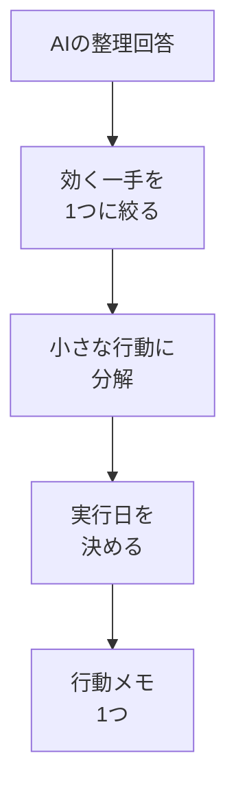

# 回答を次の行動に変える

## たとえ話

> 天気予報を見て「明日は雨らしい」と知っても、それだけでは濡れずにすまない。傘を玄関に出す、洗濯を明日に回す、家を早めに出る——情報を小さな行動に置き換えて、はじめて予報は役に立つ。立派な予報を眺めるだけで一日が終われば、知らなかったのとあまり変わらない。

> AIの回答も、これとよく似ている。整理された立派な答えをもらっても、読んで「なるほど」で終われば、何も変わらない。大切なのは、長い回答の中から「明日の自分が動ける一歩」を取り出すことだ。だから今日は、前回の相談の答えを、いつ・何をするかまで落とし込む練習をする。回答を行動に変える型を持っておくと、AIを使うたびに前へ進めるようになるからだ。

## 今日のゴール

- 06で得たAIの回答を、「いつ・何をするか」が決まった行動メモ1つに変える。

## この教材で伸ばす力

**進める力** — 受け取った情報を、具体的な次の一歩に変える

## 学びの段階

完了条件は **「できる」** — AIの回答から行動を1つ取り出し、実行日を決めて書いたこと

## 前提確認

- すでにできる前提：06でAIに困りごとを相談し、整理メモを残した
- まだ知らなくてよいこと：複数の行動を同時に管理する仕組み

## なぜ大事か

AIの回答は、放っておくと「読んで満足」で終わりやすいものです。
回答を **小さく具体的な行動** に分けて、実行する日を決めると、はじめて仕事が前に進みます。
「全部やる」ではなく「まず1つ」を選ぶことが、続けるコツです。

## 読んで学ぶ

### 回答を行動に変える3ステップ

1. **絞る** — 回答の中から、効きそうで、すぐ着手できるものを1つ選ぶ
2. **小さくする** — 「仕組みを作る」ではなく「テンプレ文を1本書く」まで分解する
3. **日付を入れる** — 「いつやるか」を決める。決めない行動は動き出さない

### AIに行動化を手伝ってもらう型

```
【前回の整理】06でもらった論点を要約して貼る
【お願い】この中から、ひとりでも今週中に着手できる小さな行動を3つに分けてください。
各行動は「いつ・何を・どのくらいの時間で」の形で、具体的に書いてください
```

### 図解



## 手順

### 1. 06の回答を用意する

1. 06で残した整理メモ（`consult-memo.txt` など）を開く。
2. 印をつけた論点を、もう一度ざっと読む。

### 2. 行動化プロンプトを送る

使うAIを開き、次をコピーして埋め、送る：

```
【前回の整理】（06でもらった論点を3行ほどに要約して貼る）
【お願い】この中から、ひとりでも今週中に着手できる小さな行動を3つに分けてください。
各行動は「いつ・何を・どのくらいの時間で」の形で、具体的に書いてください
```

### 3. 1つだけ選ぶ

1. 返ってきた3つのうち、**いちばん始めやすい1つ** を選ぶ。
2. 残り2つは「あとで」リストに置いておく（今日はやらなくてよい）。

### 4. 行動メモに書く

メモ帳に、次の形で1行書く：

```
□ ◯月◯日（◯）に、◯◯を、◯◯分でやる
```

例：
```
□ 6月18日（木）に、問い合わせへの定型返信文を1本作る、20分でやる
```

> **個人情報注意**：行動メモにも、お客さまの実名や具体的な金額は書かない。

## わからないまま進まないチェック

- 「3つとも大きく感じる」→ さらに「最初の5分でできること」をAIに聞き直す
- 「どれを選べばいい？」→ 効果より「始めやすさ」で選ぶ。動き出しが最優先
- 「日付が決められない」→ 仮でよい。後でずらしてよい

## できたらOK

- [ ] 回答を3つの行動に分けた
- [ ] その中から1つを選んだ
- [ ] 実行日を入れた行動メモを1つ書いた

## つまずいたら

### 躓いたら戻る先

- [06-business-consult](./06-業務の困りごとをAIに相談する.md)
- [第5章：習慣と時間](../../第05章-習慣と時間管理/)

```text
【今やっている教材】第11章 07-action-from-answer

【詰まったところ】

【試したこと】

【どうなればOKか】行動を1つに絞り、実行日入りのメモが書ければOK
```

## 今日の成果物

- 実行日が入った行動メモ1つ

## 問い

選んだ一歩は、あなたにとって「今週中に本当に手をつけられそう」な大きさだったでしょうか。もし重く感じるなら、何を削れば軽くなりそうでしょうか。
