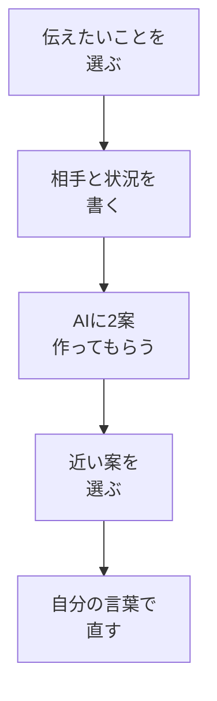

# 業務文案のたたき台を作る

## たとえ話

> 何かを人に伝えるとき、頭の中ではわかっているのに、いざ文章にしようとすると手が止まることがあります。道案内でも同じです。自分は道を知っていても、相手がどこから来るのか、何に迷いやすいのかを考えずに話すと、説明は長くなるのに伝わりません。
>
> 仕事の文案も、これとよく似ています。伝えたいことを全部並べるより、誰に、何を、どんな順番で伝えるかを整えるほうが届きやすくなります。AIは、その最初のたたき台を作る相手になります。今日は、予約や問い合わせへの案内文、サービス説明、確認メッセージなど、仕事で使う短い文案をAIに作ってもらい、自分の言葉で直す練習をします。

## 今日のゴール

- 自分の仕事で使う短い業務文案を1つ選び、AIにたたき台を作ってもらい、自分で1行以上直す。

## この教材で伸ばす力

**作る力** — ゼロから悩まず、たたき台に自分の判断を足して使える形にする

## 学びの段階

完了条件は **「できる」** — 業務文案のたたき台を作り、自分の言葉で直した文案を1本残したこと

## 前提確認

- すでにできる前提：03でプロンプトの型、05で平均を超える一手を試した
- まだ知らなくてよいこと：広告文・セールスライティングの細かい技術

## なぜ大事か

仕事では、案内文、確認メッセージ、説明文、問い合わせ返信など、短い文章を書く場面が何度もあります。
毎回ゼロから書くと時間がかかりますが、AIにたたき台を作ってもらえば、時間を「自分の仕事に合うように直す」ことへ使えます。
ただし、AIの文をそのまま使うのではなく、最後に自分の目で確認します。

## 読んで学ぶ

### 業務文案を頼むときの型

```
【目的】何を伝えたいか
【相手】誰に向けた文か
【状況】相手は何を知っていて、何に迷いそうか
【制約】文字数、避けたい言葉、やわらかさ
【お願い】文案を2パターン作ってください
```

### 使いやすい文案の例

- 予約や問い合わせへの返信文
- サービス内容の短い説明
- 初めてのお客さま向けの案内文
- 申し込み前に確認してほしいこと
- よくある質問への回答文

### 図解



## 手順

### ステップ1：文案の種類を1つ選ぶ（3分）

次の中から1つ選びます。

- 予約や問い合わせへの返信文
- サービス説明の短い文章
- お客さまへの確認メッセージ
- よくある質問への回答文

今日は1つだけで十分です。

### ステップ2：相談セットを書く（5分）

メモに次を埋めます。

```text
【目的】

【相手】

【状況】

【避けたい言い方】

【文の長さ】
```

実名、電話番号、住所、契約内容の細部は書きません。

### ステップ3：AIに依頼する（5分）

次の文をコピーして使います。

```text
次の条件で、仕事で使う短い文案を2パターン作ってください。
押しつけがましくなく、初めて読む人にも伝わる言い方にしてください。

【目的】
（ここに書く）

【相手】
（ここに書く）

【状況】
（ここに書く）

【避けたい言い方】
（ここに書く）

【文の長さ】
（ここに書く）
```

### ステップ4：1行だけ自分で直す（7分）

AIが出した2案を見比べます。

1. 使いやすそうな案を1つ選ぶ
2. 違和感のある言葉を1つ見つける
3. 自分の言葉で1行だけ直す

## できたらOK

- [ ] 業務文案の種類を1つ選んだ
- [ ] AIに2案作ってもらった
- [ ] 1案を選び、自分で1行以上直した
- [ ] 実名や機密情報を入れていない

## つまずいたら

### 躓いたら戻る先

- [06-business-consult](./06-業務の困りごとをAIに相談する.md)
- [05-beyond-average](./05-平均的な回答を超える考え方.md)

```text
【今やっている教材】第11章 08-business-message

【詰まったところ】

【試したこと】

【どうなればOKか】業務文案を1本残せればOK
```

## 今日の成果物

- 自分で1行以上直した業務文案1本

## 問い

あなたの仕事で、毎回少し時間を使っている短い文章はどれでしょうか。
