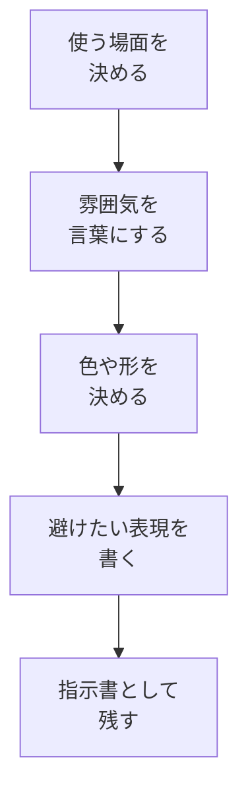

# ビジュアル指示書を作る

## たとえ話

> 家具を買い替えるとき、「落ち着いた部屋にしたい」とだけ伝えても、人によって思い浮かべる景色は違います。白っぽい部屋なのか、木の色が多い部屋なのか、明るい昼の雰囲気なのか、夜に静かに過ごす雰囲気なのか。言葉が少ないままだと、同じ「落ち着いた」でも、できあがるものは大きく変わります。
>
> 仕事で使う資料やLPの見た目も、これとよく似ています。いきなり画像を作ったりデザインを頼んだりする前に、どんな雰囲気にしたいかを言葉にしておくと、AIにも人にも相談しやすくなります。今日は、画像そのものを完成させるのではなく、後でLPや案内資料に使える「ビジュアル指示書」を作ります。見た目を言葉にする力は、作る前の迷いを減らしてくれるからです。

## 今日のゴール

- 自分のサービスや案内に合う雰囲気を、AIに相談しながら「ビジュアル指示書」にまとめる。

## この教材で伸ばす力

**整える力** — 見た目の好みを、AIや人に渡せる言葉にする

## 学びの段階

完了条件は **「できる」** — 色・雰囲気・避けたい表現を含むビジュアル指示書を1つ残したこと

## 前提確認

- すでにできる前提：08で業務文案のたたき台を作った
- まだ知らなくてよいこと：画像生成、デザインツール、細かい配色理論

## なぜ大事か

LPや案内資料を作るとき、見た目の方向性が曖昧だと、AIに頼んでも人に頼んでもやり直しが増えます。
先に「どんな雰囲気にしたいか」「何は避けたいか」を言葉にしておくと、次の制作が進めやすくなります。
これは画像生成そのものではなく、**見た目を相談できる形に整える練習**です。

## 読んで学ぶ

### ビジュアル指示書に入れる4つ

| 項目 | 書くこと |
|---|---|
| 目的 | 何のために使う見た目か |
| 雰囲気 | 落ち着いた、明るい、信頼感がある、親しみやすいなど |
| 色・形 | 白中心、余白多め、丸みのある印象など |
| 避けたいこと | 派手すぎる、安っぽい、読みにくいなど |

### 図解



## 手順

### ステップ1：使う場面を1つ決める（3分）

今日は、次のどれか1つを選びます。

- LPの最初の見た目
- サービス説明資料の雰囲気
- 予約や問い合わせページの印象
- お客さま向けの案内資料

### ステップ2：雰囲気を3語で書く（5分）

たとえば、次のように書きます。

```text
落ち着いた
信頼感がある
初めての人にもやさしい
```

うまく出ないときは、「派手すぎない」「読みにくくない」のように、避けたい方向から考えても大丈夫です。

### ステップ3：AIに候補を出してもらう（7分）

次の文をコピーして使います。

```text
次の用途に合うビジュアル指示書を作りたいです。
画像そのものではなく、色・雰囲気・余白・避けたい表現を文章で整理してください。

【用途】
（ここに書く）

【雰囲気の候補】
（ここに3語書く）

【避けたい印象】
（ここに書く）
```

### ステップ4：指示書を1つにまとめる（10分）

AIの回答から、使えそうな部分を抜き出して、次の形に整えます。

```text
【用途】

【雰囲気】

【色・余白】

【避けたい表現】

【次に作るもの】
```

## できたらOK

- [ ] 使う場面を1つ選んだ
- [ ] 雰囲気を3語以上書いた
- [ ] AIに候補を出してもらった
- [ ] ビジュアル指示書を1つ残した

## つまずいたら

### 躓いたら戻る先

- [08-business-message](./08-業務文案のたたき台を作る.md)
- [第7章：相談セット](../../第07章-AI情報設計/04-目的・背景・制約・資料の相談セット.md)

```text
【今やっている教材】第11章 09-visual-brief

【詰まったところ】

【試したこと】

【どうなればOKか】ビジュアル指示書を1つ残せればOK
```

## 今日の成果物

- 色・雰囲気・避けたい表現を含むビジュアル指示書

## 問い

あなたのサービスや案内は、初めて見る人にどんな空気で届いてほしいでしょうか。
