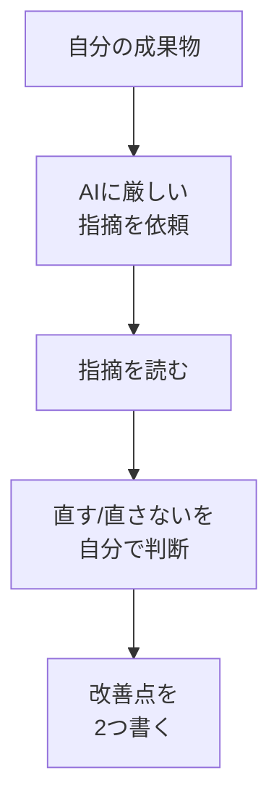

# Grill Meで思考と成果物を詰める

## たとえ話

> 大事な話をする前に、身近な誰かに「ちょっと聞いてくれる？」と練習台になってもらうことがある。聞き手が「そこ、どういう意味？」「相手はそれで動く？」と素朴に突っ込んでくれると、自分では気づけなかった抜けが見えてくる。ほめてもらうより、痛いところを先に突かれたほうが、本番でずっと楽になる。

> 自分の考えや作ったものを見直すときも、これとよく似ている。自分ひとりで眺めていると、どうしても甘く見てしまう。そこで、AIにあえて「厳しい突っ込み役」をお願いする方法がある。これをGuildでは Grill Me（自分を炙る）と呼ぶ。今日は、ここまでに作った成果物を、AIに遠慮なく詰めてもらう。詰められること自体が、自分の考えの穴を自分で見つける練習になるからだ。

## 今日のゴール

- ここまでに作った成果物を1つ選び、AIにGrill Me（厳しい指摘）を頼み、改善点を2つ以上書き出す。

## この教材で伸ばす力

**正しく考える力** — 自分の思考と成果物を、第三者の目で見直す（メタ認知）

## 学びの段階

完了条件は **「できる」** — Grill Meを依頼し、出た指摘から改善点を2つ以上、自分の言葉で書いたこと

## 前提確認

- すでにできる前提：06〜09で相談・行動メモ・業務文案・ビジュアル指示書のいずれかを作った
- まだ知らなくてよいこと：高度な議論の組み立て方

## なぜ大事か

人は自分の作ったものを、つい甘く評価しがちです。
AIに **あえて厳しい指摘役** を頼むと、自分では気づけない穴を先に見つけられます。
これは「自分の考えを見直す力（メタ認知）」の練習で、AIを使わない仕事の場面でも効いてきます。

## 読んで学ぶ

### Grill Me とは

**Grill Me** は「私を炙って（厳しく問い詰めて）」という意味です。
ほめてもらうのではなく、**弱いところ・抜けているところを先に指摘してもらう** 頼み方です。

### Grill Me プロンプトの型

```
あなたは厳しいが公平なレビュアーです。お世辞は不要です。
次の【成果物】について、弱い点・抜けている点・読み手が迷う点を、優先度をつけて指摘してください。
そのうえで、直すための具体的な提案を3つ出してください。

【成果物】
（ここに、06〜09で作ったものを貼る）

【読み手】
（誰に向けたものか）
```

### 指摘を「鵜呑みにしない」

Grill Meの指摘も、AIの回答のひとつです。
全部直す必要はありません。**自分で「これは直す/直さない」を判断する** ことまでが今日の練習です。

### 図解



## 手順

### 1. 詰めてもらう成果物を1つ選ぶ

1. 06〜09で作ったもの（相談メモ・行動メモ・業務文案・ビジュアル指示書）から1つ選ぶ。
2. AIに貼れるよう、テキストをコピーしておく。

### 2. Grill Meを依頼する

使うAIを開き、上の型をコピーして【成果物】を埋め、送る：

```
あなたは厳しいが公平なレビュアーです。お世辞は不要です。
次の【成果物】について、弱い点・抜けている点・読み手が迷う点を、優先度をつけて指摘してください。
そのうえで、直すための具体的な提案を3つ出してください。

【成果物】
（08で作った業務文案、または09で作ったビジュアル指示書を貼る）

【読み手】
これまで来てくれたお客さま
```

### 3. 指摘を仕分ける

1. 出てきた指摘を読み、「なるほど」と思うものに印をつける。
2. 「これは自分の意図と違う」と思うものは、直さなくてよい。

### 4. 改善点を2つ書く

メモ帳に、次の形で2つ以上書く：

```
・直すところ：◯◯ → こう直す：◯◯
・直すところ：◯◯ → こう直す：◯◯
```

> **個人情報注意**：成果物を貼るときも、実名・電話・住所・具体的な金額は匿名化したまま渡す。

## わからないまま進まないチェック

- 「指摘が厳しすぎてつらい」→ Grill Meは作品への指摘で、人格否定ではない。使える部分だけ拾う
- 「全部正しく見える」→ 全部直さなくてよい。優先度の高い2つだけで十分
- 「ほめてほしくなった」→ 別の機会に。今日は穴を見つける練習

## できたらOK

- [ ] 成果物を1つ選んでGrill Meを依頼した
- [ ] 指摘を「直す/直さない」で仕分けた
- [ ] 改善点を2つ以上、自分の言葉で書いた

## つまずいたら

### 躓いたら戻る先

- [05-beyond-average](./05-平均的な回答を超える考え方.md)
- [第2章：学びの土台](../../第02章-学びの土台/)

```text
【今やっている教材】第11章 10-grill-me

【詰まったところ】

【試したこと】

【どうなればOKか】Grill Meを依頼し、改善点を2つ以上書ければOK
```

## 今日の成果物

- Grill Meの指摘から取り出した改善点メモ（2つ以上）

## 問い

AIに詰められて、いちばん「言われてみればそうだ」と感じた指摘はどれだったでしょうか。それは、自分ひとりでは気づけたものだったでしょうか。
