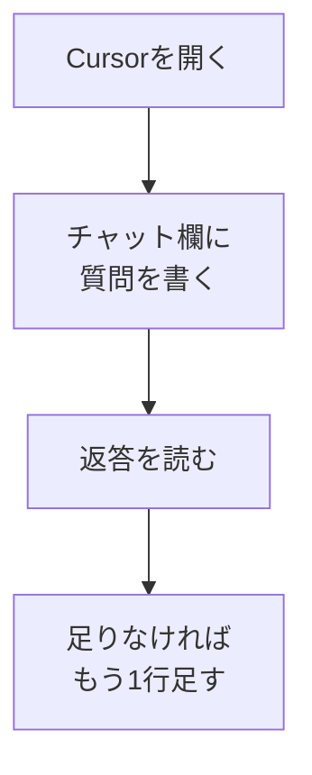

# CursorでAIに質問する

## たとえ話

> やりたい作業のたびに、道具は別の部屋へ取りに行き、メモは台所、相談できる相手は玄関先、というふうにあちこちを行き来していると、それだけで一日が終わってしまう。同じ机の上に、道具も、書きかけのメモも、相談できる相手もそろっていれば、立ち上がる回数はぐっと減る。場所が一つにまとまっているだけで、仕事は思いのほか軽くなる。
>
> パソコンの中の作業も、これとよく似ている。文案を直したいのに、いくつものアプリを行き来しているうちに、時間だけが過ぎていくことがある。Cursorは「コードを書く人だけの道具」ではなく、仕事のメモや文案を、同じ画面のまま相談できる作業机のような場所だ。だから今日は、難しい操作はせず、その机に座って一言たずねてみる入り口だけを通っておく。

## 今日のゴール

Cursorのチャット欄を開き、**仕事に関する質問を1つ**送って、返答を読み返す。

## 前提確認

- すでにできる前提：Cursorをインストール済み、第11章でチャット型AIに質問した経験がある
- まだ知らなくてよいこと：ファイル編集の依頼、ターミナル操作、Git（次のテーマで進みます）

## このテーマで伸ばす力

**相談力** — 作業の場所（Cursor）で、困りごとを言葉にしてAIに聞く力です。

## 学びの段階

今日の完了条件は **「できる」** です。質問を1つ送り、返答を読み返せたらOKです。

## なぜ大事か

Rebuild AI Guild では、AIは「丸投げの魔法」ではなく、**相談相手**として使います。Cursorに慣れると、メモ・文案・構成案を同じ場所で整えられます。コードが読めなくても、質問と確認はできます。

たとえば「サービスの説明文をやわらかくしたい」  
「予約や問い合わせの案内を、もっと短くわかりやすくしたい」といった相談ができます。

## 図解



## 手順

用意するもの：Mac、Cursor、仕事フォルダ（第6章で作ったフォルダがあればそれを使う）

### ステップ1：Cursorを開く（3分）

1. Macの **Launchpad** または **アプリケーション** から **Cursor** を起動します。
2. 画面上部メニューの **File** → **Open Folder** を選びます。
3. 仕事用フォルダ（例：`仕事` や `rebuild-work`）を選び、**Open** を押します。

フォルダがなくても進められますが、あとでメモを残しやすくなります。

**わからないまま進まないチェック**：Cursorが起動しない → Discordで「Cursorが開かない」と聞いてください。今日はインストール確認からでOKです。

### ステップ2：チャット欄を開く（2分）

1. 画面右側、または **Cmd + L**（Mac）でチャットパネルを開きます。
2. 下の入力欄にカーソルがあることを確認します。

**スクショ案内**：チャット入力欄が画面のどこにあるか、自分の画面で一度確認しておいてください。

### ステップ3：質問を1つ書く（10分）

次のテンプレをコピーし、○○を自分の言葉に置き換えて送ります。

```text
【目的】
○○の文案を整えたい

【背景】
今は□□のように書いているが、伝わりにくい

【お願い】
3パターンの短い案を出してください。専門用語は少なめで。

【やってほしくないこと】
お客さまの名前・料金の具体数字は入れないでください
```

例：「看板サービスの説明文」  
例：「お試し・体験の案内文」

**個人情報・機密情報の注意**：本名、電話番号、売上、お客さまの記録の中身は送らないでください。

### ステップ4：返答を読み、1行だけフィードバック（10分）

返答を読み、「いちばん近い案はどれか」をメモに1行書きます。

足りなければ、追加で1行だけ送ります。

```text
2番目の案が近いです。もう少しやわらかい言い回しにしてください。
```

## できたらOK

- Cursorのチャットに質問を1つ送れた
- 返答を読み、近い案を1つ選べた（または「どれも違う」と気づけた）
- 機密情報を送っていない

## つまずいたら

**躓いたら戻る先**：[第11章 業務の困りごとをAIに相談する](../../第11章-汎用AI活用/)（プロンプトの基本）  
[第8章 エディタの基本](../../第08章-エディタ基礎/01-フォルダを開く.md)（フォルダを開く操作）

| つまずき | 対処 |
|---|---|
| チャット欄が見つからない | **View** → **Chat** を選ぶ、または **Cmd + L** |
| 返答が長すぎる | 「200字以内で」「3行で」と追加する |
| 内容がズレている | 目的・背景を1文ずつ足す |

Discord質問テンプレ：

```text
【今やっている教材】
第12章 01 CursorでAIに質問する

【詰まったところ】
（例：チャット欄が出てこない）

【試したこと】
（例：Cmd + L を押した）

【スクショやエラー文】
（画面のスクショがあれば添付）

【どうなればOKか】
（例：チャットの場所を教えてほしい）
```

## 今日の成果物

- Cursorへの質問文（チャット履歴に残っていればOK）
- 「近い案はどれか」の1行メモ

## 問い

チャット型AIとCursorで質問するとき、**いちばん違うと感じたこと**は何でしょうか。  
次にCursorで聞いてみたい仕事の困りごとは何でしょうか。
