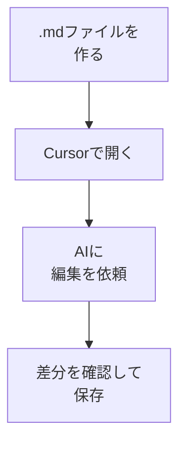

# ファイル編集をAIに依頼する

## たとえ話

> 文章を手で何度も書き直していると、どれが最新の版なのか、だんだんわからなくなってくる。机の上に似たような紙が積み重なり、直したはずの箇所がまた元に戻っていたりする。そんなとき、「この段落だけ、もう少しやわらかく」と頼める相手が隣にいて、その場で赤を入れてくれたら、書き直しの往復はずいぶん減るはずだ。
>
> パソコンの中の文案づくりも、これとよく似ている。仕事のメモや案内文は、たいてい「ファイル」として残る。Cursorでは、開いているファイルをAIに見せながら、「どこを、どう直すか」を伝えて手伝ってもらえる。だから今日は、小さなファイルを一つ作り、その中の一か所だけを直してもらう練習をする。全部を任せるのではなく、直す場所を自分で決めて頼むのがこつだ。

## 今日のゴール

Markdownファイルを1つ作り、CursorのAIに**1か所だけ**書き換えてもらい、保存を確認する。

## 前提確認

- すでにできる前提：第12章01でCursorのチャットを使った、第8章でファイルの新規作成・保存のイメージがある
- まだ知らなくてよいこと：複数ファイルの一括編集、Git

## このテーマで伸ばす力

**作る力** — 小さなファイルを作り、AIと一緒に中身を整える力です。

## 学びの段階

今日の完了条件は **「できる」** です。ファイルが1か所更新され、保存できていればOKです。

## なぜ大事か

仕事の文案やメモは、だいたい「ファイル」として残ります。AIに**どのファイルのどこを直すか**を伝えると、コピペのミスが減ります。コードが読めなくても、「この段落を短くして」と頼めます。

## 図解



## 手順

### ステップ1：メモ用ファイルを作る（5分）

1. 仕事フォルダの中に `memo` フォルダを作ります（Finderで右クリック → **新規フォルダ**）。
2. Cursorの左サイドバーで `memo` を右クリック → **New File**。
3. ファイル名を `service-memo.md` にします（自分の仕事に合う名前でOK）。
4. 次の3行だけ書いて **Cmd + S** で保存します。

```markdown
# サービス案内メモ

サービスの説明文（下書き）
今の文：○○（自分の下書きを1〜2行）
```

**わからないまま進まないチェック**：ファイル名の `.md` が消えた → 末尾が `.md` になっているか確認してください。

### ステップ2：AIに編集を依頼する（10分）

1. `service-memo.md` を開いたまま、チャット（**Cmd + L**）を開きます。
2. 次の指示を送ります（○○は自分のファイル名に合わせる）。

```text
@service-memo.md の「サービスの説明文」の段落だけ、
お客さま向けにやわらかい言い回しに書き換えてください。
他の見出しは変えないでください。
お客さまの名前・料金の数字は入れないでください。
```

`@` とファイル名で、**どのファイルか**をAIに伝えられます。

### ステップ3：変更を確認して保存（10分）

1. 画面に表示された変更（緑や赤の差分）を目で追います。
2. **Accept**（承認）または **Apply** のボタンを押す前に、次を確認します。
   - 変更対象が `service-memo.md` だけになっている
   - 知らないファイルや、頼んでいないファイルが含まれていない
   - 「サービスの説明文」の段落以外が大きく変わっていない
   - 差分を見ても不安な場合は、押さずにスクショをDiscordへ送る
3. 問題なさそうなら **Accept** または **Apply** を押します。なければ、提案された文を自分でコピーして貼り替えてもOKです。
4. **Cmd + S** で保存します。
5. ファイルを閉じて再度開き、変更が残っているか確認します。

**スクショ案内**：差分表示の画面を一度スクショしておくと、あとでDiscordで質問しやすくなります。

**止まる条件**：知らないファイルが含まれる、削除が多い、個人情報が追加されている、意味がわからない変更がある。この場合はApply / Acceptを押さずに止まります。

### ステップ4：やってはいけないことの確認（5分）

次を送っていなければOKです。

- お客さまの本名
- お客さまの記録の全文
- パスワードや口座情報

## できたらOK

- `.md` ファイルが1つある
- AIに1か所の編集を依頼した
- 保存後、変更がファイルに残っている

## つまずいたら

**躓いたら戻る先**：[01 CursorでAIに質問する](./01-CursorでAIに質問する.md)  
[第8章 ファイルの新規作成・保存](../../第08章-エディタ基礎/02-ファイルを作る・保存する.md)

| つまずき | 対処 |
|---|---|
| `@` でファイルが出ない | 先にファイルを保存（Cmd + S）してから再度 `@` |
| 全部書き換わった | 「この段落だけ」と範囲を指定し直す |
| 保存できない | フォルダの書き込み権限、または別名で保存を試す |
| 知らないファイルが変わる | Apply / Acceptを押さず、差分スクショをDiscordへ |

## 今日の成果物

- 編集済みの `service-memo.md`

## 問い

AIに直してもらう前と後で、**いちばん楽になった作業**は何でしょうか。  
次にファイル編集で頼んでみたい仕事のメモは何でしょうか。
