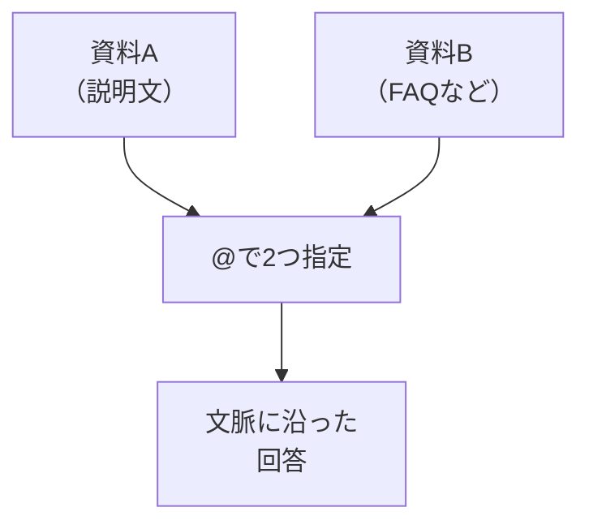

# 関連ファイルを見ながら相談する

## たとえ話

> 一つの段取りを決めるのに必要な紙が、別々の引き出しにしまってあると、片方だけを見て話を進めてしまいがちだ。料金の考え方は手前の引き出し、説明の文案は奥の引き出し、というふうに離れていると、両方を突き合わせる前に結論を出してしまう。すると、あとから「もう片方と食い違っていた」と気づくことになる。
>
> 仕事の判断は、たいてい一枚の紙では完結せず、いくつかの情報がセットになっている。AIに相談するときも同じで、片方だけを見せれば、答えはどうしてもかたよる。Cursorでは、関連するファイルを同時に見せながら相談できる。だから今日は、つながりのある二つの資料をそろえ、両方をいっしょに渡して一つの質問をしてみる。情報がそろうほど、返ってくる答えはぶれにくくなるからだ。

## 今日のゴール

関連するMarkdownファイルを**2つ**用意し、CursorのAIに**両方を見ながら**1つの質問を送る。

## 前提確認

- すでにできる前提：第12章02で1ファイルの編集依頼ができた
- まだ知らなくてよいこと：大規模なプロジェクト構成、自動でフォルダ全体を読み込む高度な設定

## このテーマで伸ばす力

**整理力・相談力** — 関連資料を揃え、AIに文脈ごと伝える力です。

## 学びの段階

今日の完了条件は **「できる」** です。2ファイルを `@` で指定して質問できればOKです。

## なぜ大事か

仕事の判断は、だいたい複数の情報がセットです。たとえば「サービスの説明」と「料金の考え方」、あるいは「予約や問い合わせの案内」と「よくある質問」のように、いつもセットで見る資料があります。**関連ファイルを渡す**と、AIの答えがぶれにくくなります。

## 図解



## 手順

### ステップ1：関連ファイルを2つ用意する（10分）

`memo` フォルダに、次の2ファイルを作ります（第12章02のファイルを流用してもOK）。

**ファイル1：`service-intro.md`**

```markdown
# サービス紹介（下書き）

## 看板サービス
ていねいに対応します。初めての方も安心です。

## お試し・体験の案内
はじめての方向けに、少人数でお試しできます。
```

**ファイル2：`faq-draft.md`**

```markdown
# よくある質問（下書き）

- 所要時間は？
- 料金は？
- 予約方法は？
```

それぞれ **Cmd + S** で保存します。

**わからないまま進まないチェック**：2つ目のファイルが作れない → 今日は1ファイルだけでも、`@` の練習はできます。2つ目は明日でもOKです。

### ステップ2：2ファイルを指定して質問する（10分）

チャットで次を送ります（ファイル名は自分のものに合わせる）。

```text
@service-intro.md と @faq-draft.md を読んでください。

【目的】
紹介文とFAQの言い回しをそろえたい

【お願い】
① 紹介文を2文に短くする案
② FAQの1問目への答えのたたき（仮の数字は入れない）
を出してください。

【制約】
お客さまの名前・具体料金は書かないでください
```

`@` でファイルを指定できない場合は、無理に進めず、本文を貼る形で代用できます。

```text
次の2つのファイル本文を読んで相談に乗ってください。

【service-intro.md】
（ここに本文を貼る）

【faq-draft.md】
（ここに本文を貼る）

【お願い】
紹介文とFAQの言い回しをそろえる案を出してください。
```

貼る前に、お客さまの名前、電話番号、住所詳細、秘密の情報が入っていないか確認してください。不安なら貼らずにDiscordで相談します。

### ステップ3：回答をメモに1行残す（5分）

「紹介とFAQで言葉がそろったか」を1行で書きます。

例：`「丁寧に」という言い回しをFAQ側にも使うと統一感が出そう`

### ステップ4：必要なら1ファイルだけ更新依頼（5分）

```text
@faq-draft.md の1問目だけ、@service-intro.md のトーンに合わせて書き換えてください。
```

変更を確認し、**Cmd + S** で保存します。

## できたらOK

- 関連ファイルが2つある
- `@` で2つ指定して質問した
- 回答を読み、1行メモを残した

## つまずいたら

**躓いたら戻る先**：[02 ファイル編集を依頼する](./02-ファイル編集をAIに依頼する.md)  
[第7章 AIに渡す情報とは](../../第07章-AI情報設計/01-AIに渡す情報とは.md)

| つまずき | 対処 |
|---|---|
| ファイルが1つしか選べない | メッセージ内に `@file1` `@file2` と2回書く |
| `@` 指定が使えない | ファイル本文を貼る代替手順を使う。貼る前に個人情報を確認 |
| 内容が矛盾している | 「どちらを優先するか」を1行追加する |
| 長すぎる回答 | 「各50字以内で」と制約を足す |

## 今日の成果物

- `service-intro.md` と `faq-draft.md`（または同等の2ファイル）
- 統一感についての1行メモ

## 問い

あなたの仕事で、**いつもセットで見る資料**は何と何でしょうか。  
2つを揃えると、AIの答えはどう変わりそうでしょうか。
