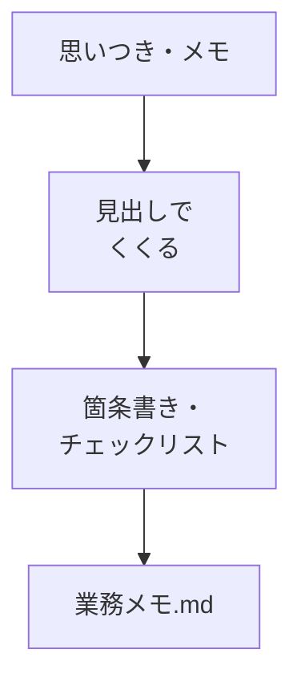

# Markdownで業務メモを整える

## たとえ話

> 思いついたことを、その場にあった紙の端や、誰かとのやりとりの画面に書き留めていくと、いざ必要なときに限って見つからない。同じ内容を何度もメモしていたり、大事な一行がどこかに埋もれていたりする。決まった形でひとところに書く習慣があるだけで、探す時間も、書き直す手間も、ずいぶん減っていく。
>
> パソコンの中のメモも、これとよく似ている。見出しと箇条書きで整える書き方を一つ覚えておくと、後から自分でも読み返しやすく、AIにも渡しやすい形で残せる。Markdownは、そのための身近な記法だ。だから今日は、難しい知識ではなく、見出しと箇条書きとチェックリストという三つの道具だけで、仕事のメモを一本整えてみる。整った材料は、このあとの作業をそのまま助けてくれる。

## 今日のゴール

業務メモを1本、Markdown形式で作り、見出し・箇条書き・チェックリストを入れて保存する。

## 前提確認

- すでにできる前提：Cursorで `.md` ファイルを作って保存できた
- まだ知らなくてよいこと：HTML、Webサイトの仕組み

## このテーマで伸ばす力

**整える力** — 散らばった情報を、見出しとリストで読みやすくする力です。

## 学びの段階

今日の完了条件は **「できる」** です。指定の構造を持つ `.md` ファイルが1つあればOKです。

## なぜ大事か

第13章のAIチーム設計や、第14章のLP制作では、メモがそのまま「材料」になります。MarkdownはGitHubでも読みやすく、CursorのAIも扱いやすい形式です。

## 図解



## 手順

### ステップ1：テンプレをコピーする（5分）

`memo` フォルダに `business-memo.md` を作り、次を貼り付けます（○○は自分の言葉に）。

```markdown
# 業務メモ：○○

## いま困っていること
- 

## やりたいこと（今月）
- 

## 参考にする資料
- サービス一覧
- 予約や問い合わせの導線

## 次の一手（5分でできる）
- [ ] 
```

**Cmd + S** で保存します。

### ステップ2：中身を埋める（15分）

記入例：

```markdown
# 業務メモ：サービス案内の整備

## いま困っていること
- 説明文が長くて、初めての方に伝わりにくい

## やりたいこと（今月）
- 説明文を3行に短くする
- FAQに所要時間を1行足す

## 参考にする資料
- サービス一覧（紙）
- 予約や問い合わせの定型文

## 次の一手（5分でできる）
- [ ] 今の説明文をこのファイルにコピーする（個人名は消す）
```

自分の仕事に合わせて、サービス名や案内の言葉を置き換えてください。

**わからないまま進まないチェック**：`#` や `-` の意味がわからない → `#` は大見出し、`-` は箇条書きと覚えれば今日は十分です。

### ステップ3：プレビューで見る（5分）

1. `business-memo.md` を開いたまま、右上のプレビューアイコン（本のマーク）を押します。
2. 見出しが大きく、リストが並んで見えるか確認します。

**スクショ案内**：編集画面とプレビュー画面を並べたスクショを1枚撮っておくと、あとで振り返りやすいです。

### ステップ4：AIに読みやすさを1点だけ相談（5分）

```text
@business-memo.md を読んで、
「次の一手」がもっと小さくなるよう、チェック項目を1つだけ具体化してください。
個人名・料金の数字は入れないでください。
```

提案を1つ取り入れ、保存します。

## できたらOK

- `business-memo.md` に見出し・箇条書き・チェックリストがある
- プレビューで読みやすい形になっている
- 機密情報を書いていない

## つまずいたら

**躓いたら戻る先**：[第8章 Markdownの基本](../../第08章-エディタ基礎/04-Markdownを書く.md)  
[03 関連ファイルを見ながら相談する](./03-関連ファイルを見ながら相談する.md)

| つまずき | 対処 |
|---|---|
| プレビューが出ない | 拡張子が `.md` か確認する |
| チェックが表示されない | `- [ ]` の `[ ]` の間にスペースがあるか確認 |
| 書くことがない | 「困っていること」に「わからない」を書いてOK |

## 今日の成果物

- `business-memo.md`（業務メモ1本）

## 問い

紙やメッセージに散らばっていた情報を、Markdownにまとめると**どこが楽**になりそうでしょうか。  
このメモを、次のどの作業（LP・FAQ・案内文）に使えそうでしょうか。
