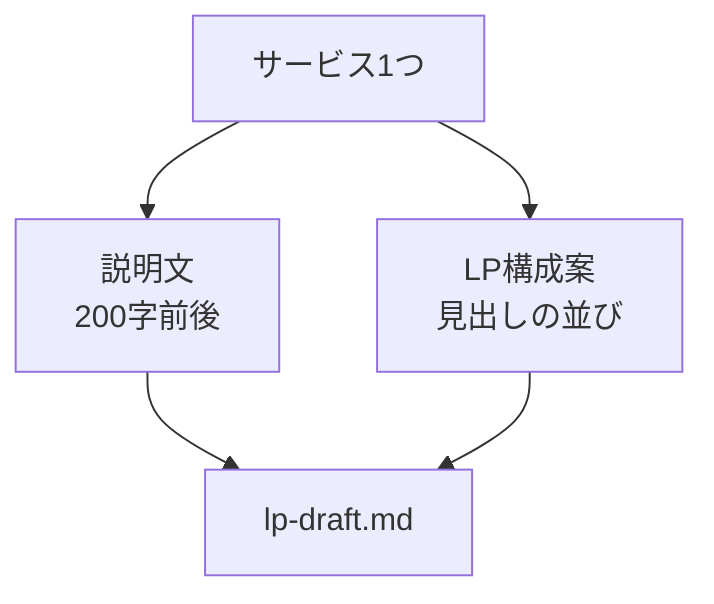

# LP構成案とサービス説明文を作る

## たとえ話

> 家を建てるとき、いきなり壁の色やカーテンを選びはじめる人はいない。先に、どこに柱を立て、どの部屋をいくつ作るのか、骨組みを決める。見た目から入ると、途中で「そもそも何のための部屋だっけ」と迷い、何度もやり直すことになる。順番を守るほど、後の作業はかえって軽くなる。
>
> ホームページづくりも、これとよく似ている。きれいなデザインから入ると重くて、たいてい途中で止まってしまう。まずは一つのサービスについて、説明の文と、ページの骨組み（どんな見出しをどの順に並べるか）だけを決めておく。だから今日は、見た目はいったん脇に置いて、骨組みと説明文を用意する。土台が先にあれば、このあとの公開までの道のりが、ずっと進めやすくなるからだ。

## 今日のゴール

選んだサービス1つについて、**LP構成案（見出しの並び）** と **サービス説明文（200字前後）** をMarkdownで残す。

## 前提確認

- すでにできる前提：第12章04で `business-memo.md` がある、CursorでAI相談ができる
- まだ知らなくてよいこと：Next.js、デザインコーディング（第14章で進みます）

## このテーマで伸ばす力

**構造化・進める力** — サービスを言葉にし、ページの順番まで決めて次章につなげる力です。

## 学びの段階

今日の完了条件は **「できる」** です。構成案と説明文が1ファイルにあればOKです。完璧なLPは目指しません。

## なぜ大事か

LP（ランディングページ）は、**1つのサービスに集中して伝える1枚のページ**です。構成が先にあると、AI実装もぶれません。第14章の最初の5本と直結します。

たとえば、いちばん依頼の多いサービス専用の1ページや、  
お試し・体験専用の1ページのように、一つに絞って作ります。

## 図解



## 手順

### ステップ1：下書きファイルを作る（3分）

`memo` フォルダに `lp-draft.md` を作り、次の見出しだけ入れます。

```markdown
# LP下書き：○○

## サービス説明文（200字前後）

## LP構成案
1. 
2. 
3. 
4. 
5. 
```

### ステップ2：AIにたたきを作ってもらう（15分）

`@business-memo.md` と `@lp-draft.md` を指定して送ります。

```text
@business-memo.md と @lp-draft.md を読んでください。

【目的】
第14章で公開するLPのたたきを作りたい

【サービス】
（例：いちばん依頼の多いサービス、またはお試し・体験）

【お願い】
1. サービス説明文を200字前後で書く（やわらかい口調、専門用語少なめ）
2. LP構成案を5つの見出しで書く（ヒーロー・悩み・選ばれる理由・料金の考え方・FAQ・問い合わせ のうち5つ選んでOK）

【制約】
お客さまの名前・具体料金・住所の詳細は入れない
「申し込み」は「お問い合わせ」表現にする
```

返答を `lp-draft.md` に反映し、**Cmd + S** で保存します。

### ステップ3：自分の言葉で1か所直す（7分）

AIの文のうち、しっくりこない1か所だけ手で直します。全部書き直す必要はありません。

**わからないまま進まないチェック**：200字が長すぎる → 150字でもOKです。空欄が残っていても、見出し5つが並んでいれば今日は完了です。

### ステップ4：第14章用フォルダの準備（5分）

仕事フォルダに `lp-site用メモ` フォルダを作り、`lp-draft.md` をコピーして入れておきます（第14章で使います）。第14章07で作るNext.jsプロジェクト `~/Documents/Rebuild練習用/lp-site` とは別の、下書き用フォルダです。

Finderで `lp-draft.md` を **Cmd + C** → `lp-site用メモ` で **Cmd + V** で十分です。

## できたらOK

- `lp-draft.md` に説明文と構成案（見出し5つ前後）がある
- 自分の言葉で1か所以上手を入れた
- `lp-site用メモ` にコピーがある
- 機密情報を入れていない

## つまずいたら

**躓いたら戻る先**：[04 Markdown業務メモ](./04-Markdownで業務メモを整える.md)  
[第1章 目標を整理する](../../第01章-目標と習慣/01-目標を整理する.md)（何のためのLPか）

| つまずき | 対処 |
|---|---|
| サービスが決まらない | いちばん依頼が多いサービスを1つ選ぶ |
| 構成が多すぎる | 見出しを5つに減らすようAIに頼む |
| 説明文が硬い | 「友だちに説明する口調で」と追加 |

## 今日の成果物

- `lp-draft.md`（説明文＋LP構成案）
- `lp-site用メモ` フォルダ内のコピー

## 問い

このLPで、**いちばん先に伝えたいこと**は何でしょうか。  
第14章で公開したとき、誰にURLを見せたいでしょうか。
