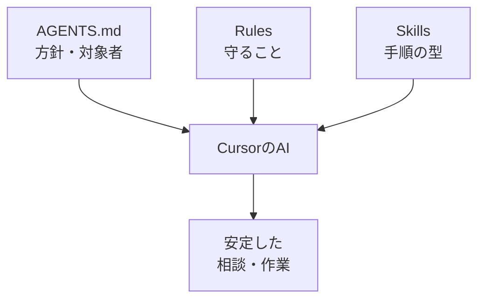

# AIチームとは何か

## たとえ話

> 新しく入った人に、毎回ゼロから「うちのやり方」を口で説明していると、伝え忘れも出るし、人によって教える内容がぶれてしまう。そこで多くの場所では、方針や決まりごと、よくある作業の手順を一冊のノートにまとめておく。ノートがあれば、誰が読んでも同じ土台から始められ、説明する側の負担もぐっと軽くなる。
>
> AIとのつきあい方も、これとよく似ている。相談のたびに前提を説明し直すと、答えのぶれが大きくなっていく。方針・守ってほしいこと・よくある手順をファイルに残しておくと、AIは作業の前にそれを読み直してくれる。これが「AIチーム」と呼ばれる仕組みだ。魔法ではなく、仕事の型を置いておく場所にすぎない。だから今日は、その三つの部品が何のためにあるのかを、自分の言葉でつかんでおく。

## 今日のゴール

AIチーム（AGENTS / Rules / Skills）が何のためのものか、自分の言葉で説明できる。4択チェックに答える。

## 前提確認

- すでにできる前提：第12章でCursorに質問・ファイル編集ができた、第7章でAIに渡す情報の考え方を学んだ
- まだ知らなくてよいこと：subエージェント、複雑な自動化（発展コースの内容）

## このテーマで伸ばす力

**判断する力・構造化** — 毎回ゼロから説明せず、方針とルールを分けてAIに伝える力です。

## 学びの段階

今日の完了条件は **「わかった」** です。4択に答え、答えページで確認できればOKです。

## なぜ大事か

Rebuild AI Guild の初期必修の到達点のひとつが **AIチーム設計** です。コードが書けなくても、**誰向けに・何をして・何をしてはいけないか**をファイルに書けます。たとえば「お店のトーンと機密情報の扱い」や「お客さま向けの言葉づかいと個人情報の扱い」を、毎回ぶれずに固定できます。

## 読んで学ぶ

### AIチームの3つの部品

| 部品 | 役割 | 例えるなら |
|---|---|---|
| **AGENTS.md** | 全体の方針・誰向けか・ミッション | お店の看板と方針 |
| **Rules** | 毎回守るルール・禁止事項 | 店内のルール張り |
| **Skills** | よく使う手順の型 | レシピカード |

これらはCursorの `.cursor/` フォルダなどに置き、AIが作業前に読みます。**人間が判断して書く**のが大事です。AIに全部任せるものではありません。

### 図解



### やってはいけない誤解

- 「AIチームを作れば自動で全部やってくれる」→ **違います**。方針と手順を整えると、ぶれが減るだけです。
- 「機密をRulesに書けば安全」→ **違います**。お客さまの記録や本名はファイルにもAIにも入れません。
- 「専門職だけのもの」→ **違います**。小規模事業の文案・メモ整理にも使えます。

**わからないまま進まないチェック**：3つの名前がごちゃごちゃ → 今日は「AGENTS＝方針、Rules＝禁止と守ること、Skills＝手順」だけ覚えればOKです。

## 手を動かす：自分の例を1行ずつ（10分）

紙かメモに、次を自分の仕事に当てはめて1行ずつ書きます（ファイル作成は次のテーマから）。

```text
AGENTSに書きたい方針：
Rulesで守らせたいこと：
Skillsにしたいよくある作業：
```

例：  
方針＝「初めてのお客さまにもやさしい言葉」  
ルール＝「お客さまの名前や対応の履歴の詳細はAIに入れない」  
スキル＝「サービス説明文を3行に短くする手順」

## 4択チェック

1. AIチームでいちばん先に決めるのに近いのはどれですか？  
   A. 毎回ランダムな口調  
   B. AGENTS.md の全体方針  
   C. パスワード一覧  
   D. お客さまの記録の全文

2. Rules の役割として最も近いのはどれですか？  
   A. 毎回守る禁止事項や作業ルールを書く  
   B. 売上を自動で集計する  
   C. PCのウイルスを消す  
   D. インターネットの速度を上げる

3. Skills があると便利なのはどんなときですか？  
   A. 同じ種類の作業を何度もするとき  
   B. PCの電源を入れるとき  
   C. 一度だけしかしないときだけ  
   D. 機密情報をそのまま送りたいとき

答え合わせはこちら：  
[答えを見る](../../答え/第13章-AIチーム設計/01-AIチームとは何か-答え.md)

## できたらOK

- AGENTS / Rules / Skills の違いをざっくり言える
- 4択チェックに答えた
- 自分の仕事の例を3行書いた

## つまずいたら

**躓いたら戻る先**：[第12章 Cursor AI基礎](../第12章-Cursor-AI/01-CursorでAIに質問する.md)  
[第7章 AIに渡す情報とは](../../第07章-AI情報設計/01-AIに渡す情報とは.md)

| つまずき | 対処 |
|---|---|
| 用語が難しい | 「看板・ルール張り・レシピ」で覚える |
| 自分に関係ない | 文案・FAQ・案内文の整理でも使える |
| 4択が不安 | 答えページで理由を読んでから次へ |

## 今日の成果物

- 4択チェックの回答（答えページで確認）
- 方針・ルール・スキルの3行メモ

## 問い

あなたの仕事で、**毎回AIに説明し直していること**は何でしょうか。  
それを AGENTS・Rules・Skills のどれに置くと、楽になりそうでしょうか。
