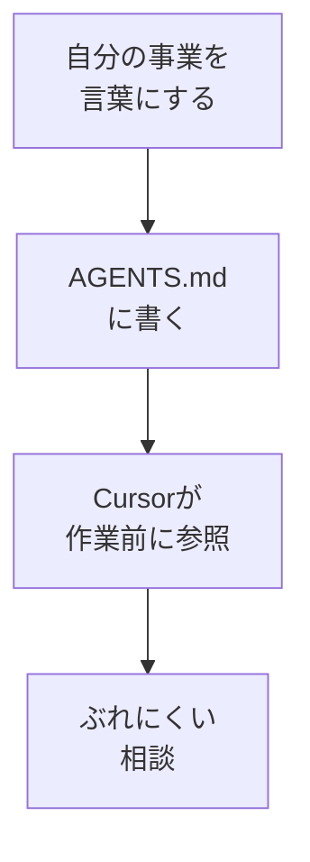

# AGENTS.mdを作る

## たとえ話

> どんな集まりでも、最初に「これは何のための会で、誰のための場なのか」を一枚の紙に書いて貼っておくと、後から来た人も迷わない。口頭で一人ずつ伝えていると、人によって受け取り方がずれていく。けれど、向かう先が一枚にまとまっていれば、みんなが同じ方向を見て動ける。最初のひと手間が、後の混乱をまとめて防いでくれる。
>
> AIに仕事を手伝ってもらうときも、これとよく似ている。「誰のために・何のために・どんな言葉で」が最初に書いてあると、相談のたびに説明し直さずにすみ、答えのぶれも小さくなる。その方針を書いておくのが **AGENTS.md** というファイルだ。難しいコードではなく、自分の事業の向かう先を言葉にするだけでいい。だから今日は、立派な文章を目指さず、方針と対象と「やってはいけないこと」を一度書き出してみる。

## 今日のゴール

仕事用フォルダに **AGENTS.md** を1つ作り、方針・対象者・やってはいけないことを書いて保存する。

## 前提確認

- すでにできる前提：第13章01でAIチームの3部品を理解した、Cursorで `.md` ファイルを作れる
- まだ知らなくてよいこと：複数のAGENTS.md、subエージェント

## このテーマで伸ばす力

**判断する力** — 自分の事業の方針を言葉にし、AIの土台にする力です。

## 学びの段階

今日の完了条件は **「できる」** です。AGENTS.mdが保存されていればOKです。完璧な文章は不要です。

## なぜ大事か

AGENTS.mdはAIチームの **看板** です。第14章のLP制作でも、このファイルを読んだAIに実装を頼むと、トーンがそろいやすくなります。

## 図解



## 手順

### ステップ1：フォルダを開く（3分）

1. 仕事フォルダ（例：`rebuild-work` や `lp-project`）をCursorで開きます。
2. ルート（いちばん上の階層）に **AGENTS.md** を新規作成します。

### ステップ2：テンプレを貼る（10分）

次をコピーし、○○を自分の言葉に置き換えます。

```markdown
# 私の仕事 AIチーム — AGENTS.md

## ミッション
○○（例：地域のお客さまにやさしいお店の案内を整える）

## 対象者（読み手）
- 例：初めての利用が不安なお客さま
- 例：サービスを検討中で、まだ迷っている方

## 言葉のトーン
- やさしい日本語、専門用語は少なめ
- 押し売りしない

## やってはいけないこと
- お客さまの名前・お客さまの記録の内容をAIに入れない
- 具体の料金・売上・住所の詳細をAIに入れない
- 「簡単です」「すぐできます」と言い切らない

## 主な業務の例
- サービス一覧の文案
- 予約や問い合わせの案内
- FAQのたたき
```

**Cmd + S** で保存します。

**わからないまま進まないチェック**：何を書けばいいかわからない → 「対象者」と「やってはいけないこと」だけ埋めれば今日はOKです。

### ステップ3：AIに不足を1つ指摘してもらう（10分）

```text
@AGENTS.md を読んで、
初心者の事業者がAIチームを使ううえで足りなさそうな項目を1つだけ提案してください。
ファイルを直接編集せず、提案だけください。
```

提案のうち1つだけ、自分の言葉でAGENTS.mdに追記し、保存します。

### ステップ4：1行テスト（7分）

```text
@AGENTS.md の方針に沿って、
選んだサービスの案内を1文だけ書いてください。
```

トーンが合うか目で確認します。合わなければAGENTS.mdを1行直します。

## できたらOK

- ルートに `AGENTS.md` がある
- ミッション・対象者・やってはいけないことが書いてある
- 機密情報を書いていない

## つまずいたら

**躓いたら戻る先**：[01 AIチームとは何か](./01-AIチームとは何か.md)

| つまずき | 対処 |
|---|---|
| 長く書きすぎる | 各見出し2〜3行で止める |
| ミッションが抽象的 | 「誰の何を楽にするか」で書く |
| 編集をAIに任せすぎ | 追記は自分の言葉で1か所だけ |

## 今日の成果物

- `AGENTS.md`（方針ファイル1本）

## 問い

AGENTS.mdに書いた **やってはいけないこと** は、あなたの仕事で本当に大切なことと一致しているでしょうか。  
第14章のLPを作るとき、どの方針をいちばん守りたいでしょうか。
