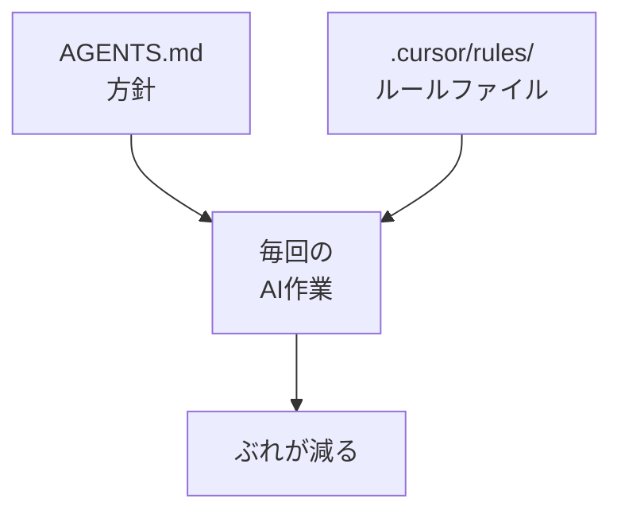

# Rulesを作る

## たとえ話

> 同じ作業を人に頼むたびに、口調や守ってほしいことが少しずつ変わってしまうと、出来上がりも毎回ばらつく。そこで多くの現場では、「ここでは必ずこうする」という決まりごとを、目につく場所に貼り出しておく。貼り紙があれば、誰がやっても、何度やっても、同じ線を守れる。毎回言わなくてよくなるぶん、頼むほうも楽になる。
>
> AIへの頼みごとも、これとよく似ている。方針は決めたつもりでも、細かい口調や禁止事項は、相談のたびにぶれやすい。「ですます調で」「機密は入れない」「短めに」といった毎回守ってほしいことを、Cursorが読み直せる場所に置いておくのが **Rules** だ。だから今日は、ぶれやすい点を一つの決まりごとにまとめ、実際に効くかどうかまで確かめてみる。看板が方針なら、これは店内の貼り紙にあたる。

## 今日のゴール

`.cursor/rules/` にルールファイルを1つ作り、保存してCursorに認識させる。

## 前提確認

- すでにできる前提：AGENTS.mdがある、Cursorでフォルダとファイルを作れる
- まだ知らなくてよいこと：複数ルールの優先順位の細かい設定

## このテーマで伸ばす力

**整える力・判断する力** — ぶれやすい点をルールに固定する力です。

## 学びの段階

今日の完了条件は **「できる」** です。ルールファイルが1つあればOKです。

## なぜ大事か

AGENTS.mdが看板なら、Rulesは **店内ルール** です。「機密を入れない」「ですます調」「200字以内」など、毎回の作業で守りたいことを書きます。

## 図解



## 手順

### ステップ1：フォルダを作る（5分）

1. Cursorの左サイドバーでプロジェクトのルートを右クリック → **New Folder** → `.cursor`
2. `.cursor` の中に `rules` フォルダを作ります。
3. `rules` の中に `00-work-style.mdc` を新規作成します。

`.mdc` はCursor用のルールファイル形式です。中身はMarkdownと同じように書けます。

**スクショ案内**：`.cursor/rules/` の場所がわかるよう、サイドバーのスクショを1枚撮っておくとよいです。

### ステップ2：ルールを書く（10分）

```markdown
---
description: 仕事文案の基本ルール
globs:
alwaysApply: true
---

# 仕事文案ルール

## 言葉
- です・ます調
- 専門用語は言い換えるか括弧で補足

## 禁止
- お客さまの名前・お客さまの記録の内容を例文に入れない
- 具体の料金・売上・住所を入れない
- 「簡単」「すぐ」と言い切らない

## 出力
- 案は最大3パターン
- 各案は200字以内を目安

## 言葉づかい
- 「顧客」より「お客さま」を使う
- サービスは一般的な言い方にする（例：サービス一覧、対応の履歴）
```

**Cmd + S** で保存します。

`globs` は「特定のファイルだけに適用したい」ときに使う設定です。今日は空のままで大丈夫です。全体に効かせたいので、`alwaysApply: true` だけ見ればOKです。

**わからないまま進まないチェック**：`.cursor` が見えない → Finderではドット始まりのフォルダが隠れることがあります。Cursorのサイドバーから作れば問題ありません。

### ステップ3：ルールが効いているか試す（10分）

新しいチャットを開き（古い履歴に引きずられないため）、次を送ります。

```text
選んだサービスの案内文を1パターンだけ書いてください。
```

- ですます調か
- 200字程度か
- 機密が入っていないか

を確認します。ズレていれば、ルールファイルを1行直して再試行します。

### ステップ4：AGENTS.mdとの重複を整理（5分）

AGENTS.mdと全く同じ文があれば、どちらか一方にまとめます。  
目安：**方針はAGENTS、毎回の細かい出力ルールはRules**。

## できたらOK

- `.cursor/rules/00-work-style.mdc` がある
- 言葉・禁止・出力のルールが書いてある
- テスト質問でトーンがおおむね合った

## つまずいたら

**躓いたら戻る先**：[02 AGENTS.mdを作る](./02-AGENTS.mdを作る.md)

| つまずき | 対処 |
|---|---|
| ルールが効かない | チャットを新規に開く、ファイルを保存し直す |
| `.mdc` が怖い | 中身は普通のMarkdownでOK |
| ルールが多すぎる | 今日は5行以内の禁止事項だけでもOK |

## 今日の成果物

- `.cursor/rules/00-work-style.mdc`

## 問い

あなたの仕事で、AIの答えが **いちばんぶれやすい点** は何でしょうか。  
それをRulesに1行足すとしたら、何と書くでしょうか。
