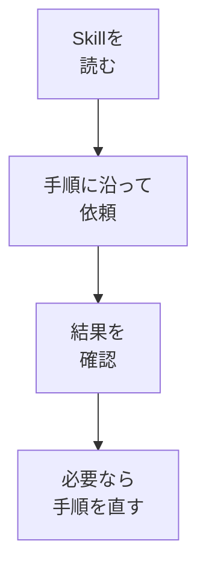

# Skillsを作る

## たとえ話

> よく作る料理ほど、いちいち分量を考え直さず、決まった手順でさっと作れる。頭の中にレシピがあるからだ。もし毎回ゼロから「何をどれだけ、どの順で」と考えていたら、同じ料理でも時間がかかり、出来にもばらつきが出る。繰り返す作業ほど、手順を一度書き留めておく値打ちがある。
>
> AIに同じ種類の作業を頼むときも、これとよく似ている。毎回ほとんど同じ指示を、その都度書いたり探したりするのは手間だし、書き方が変わると結果もぶれる。「よく使う手順」をファイルにまとめたものが **Skills** だ。レシピカードのように、同じ作業を安定して繰り返せるようになる。だから今日は、自分が何度も繰り返している作業を一つ選び、その手順を型として書き出してみる。

## 今日のゴール

`.cursor/skills/` にスキルフォルダを1つ作り、よくある業務手順を **SKILL.md** に書く。

## 前提確認

- すでにできる前提：AGENTS.mdとRulesがある
- まだ知らなくてよいこと：複雑なスキルの連鎖、subエージェント用スキル

今日は `Skills` や `SKILL.md` という名前を覚えきらなくて大丈夫です。**再利用する手順書** だとわかればOKです。

## このテーマで伸ばす力

**構造化・作る力** — 繰り返し作業を手順に分解し、再利用する力です。

## 学びの段階

今日の完了条件は **「できる」** です。SKILL.mdが1つあればOKです。

## なぜ大事か

Skillがあると、「メニュー文案を短く」「FAQを1問追加」など、**型どおりの依頼**がしやすくなります。第14章のLP改善でも使えます。

## 図解



## 手順

### ステップ1：スキル用フォルダを作る（5分）

1. `.cursor` の中に `skills` フォルダを作ります。
2. その中に `shorten-copy` フォルダを作ります（名前は「文案を短くする」の意味）。
3. `shorten-copy` の中に `SKILL.md` を作ります。

### ステップ2：SKILL.mdを書く（15分）

```markdown
---
name: shorten-copy
description: サービス説明・案内文を3行に短くする。仕事の文案向け。
---

# 文案を3行に短くする

## いつ使うか
- サービス一覧の説明が長すぎるとき
- 予約や問い合わせの案内を短くしたいとき

## 前提
- AGENTS.md と Rules を守る
- お客さまの名前・具体料金は入れない

## 手順
1. 元の文案を `@` で指定する
2. 対象読者（お客さま）を1行で伝える
3. 「3行・ですます調・専門用語少なめ」と依頼する
4. 3案出たら、いちばん近い案を選び、自分で1か所だけ直す

## 成功条件
- 3行以内になっている
- トーンがAGENTS.mdと合っている
- 機密が含まれていない

## Cursorへの依頼文テンプレ
\`\`\`text
@（元ファイル）を shorten-copy スキルに沿って3行に短くしてください。
対象読者は○○です。
\`\`\`
```

**Cmd + S** で保存します。

**わからないまま進まないチェック**：何のSkillにするか決まらない → いちばんよくやる文案作業を1つ選べばOKです。

### ステップ3：実際に試す（10分）

1. 第12章の `service-intro.md` など、長めの文案を開きます。
2. チャットで次を送ります。

```text
.cursor/skills/shorten-copy/SKILL.md の手順に沿って、
@service-intro.md を3行に短くしてください。
```

3. 結果を確認し、Skillの手順とズレがあれば SKILL.md を1行直します。

## できたらOK

- `.cursor/skills/shorten-copy/SKILL.md` がある
- いつ使うか・手順・成功条件が書いてある
- 1回試して動作を確認した

## つまずいたら

**躓いたら戻る先**：[03 Rulesを作る](./03-Rulesを作る.md)  
[第12章 関連ファイルを見ながら相談](../第12章-Cursor-AI/03-関連ファイルを見ながら相談する.md)

| つまずき | 対処 |
|---|---|
| Skillが読まれない | パスをメッセージに明示する |
| 手順が長い | 3ステップに減らす |
| 一度きりの作業 | Skill化せず、通常の質問でOK |

## 今日の成果物

- `shorten-copy/SKILL.md`（または自分用のスキル1本）

## 問い

あなたの仕事で **月に3回以上やる作業** は何でしょうか。  
それを次のSkillにするとしたら、名前は何にするでしょうか。
