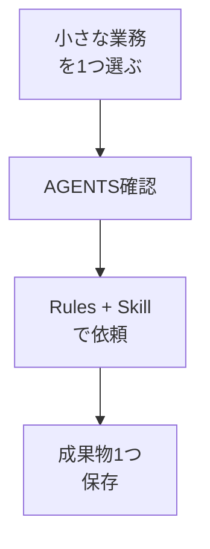

# 小さな業務でAIチームを試す

## たとえ話

> 新しい道具を手に入れても、いきなり大事な本番で使うのは怖い。だから多くの人は、まず端切れで試し縫いをしたり、メモ用紙に試し書きをしたりする。小さく試すうちに、力の入れ具合や、思っていたのと違う点が見えてくる。本番でつまずかないために、わざと小さな失敗ができる場所を、先に通っておくわけだ。
>
> せっかく整えたAIチームも、これとよく似ている。一式そろえても、いざ大きな仕事でいきなり使おうとすると、どこから手をつければいいかわからず、結局いつものやり方に戻ってしまう。だから今日は、5分ほどで終わる小さな仕事を一つ選び、方針・決まりごと・手順をまとめて試してみる。小さく成功させておくことが、次の大きな一歩への自信になるからだ。

## 今日のゴール

AGENTS.md・Rules・Skillsを使い、**小さな成果物1つ**（FAQ1問分など）を完成させる。

## 前提確認

- すでにできる前提：第13章02〜04のファイルがそろっている
- まだ知らなくてよいこと：チーム全体の自動運用、複数人での共有運用

## このテーマで伸ばす力

**進める力** — 設計したAIチームを、実際の業務サイズで試す力です。

## 学びの段階

今日の完了条件は **「できる」** です。指定の小さな成果物がファイルに残っていればOKです。

## なぜ大事か

大きなLPやシステムの前に、**小さく試す**と設定の穴が見つかります。Rebuild AI Guild では「続ける力」も大事です。今日の成功が、第14章への自信になります。

## 図解



## 手順

### ステップ1：今日の小さな業務を決める（3分）

次から **1つだけ** 選びます。

| 小さな業務の例 |
|---|
| FAQ「所要時間は？」の答え1問 |
| サービス1行の説明 |
| 予約・お問い合わせの注意書き1行 |

`memo/small-task-result.md` を新規作成します。

### ステップ2：依頼文を送る（15分）

新しいチャットを開き、次を送ります（ファイル名は環境に合わせる）。

```text
@AGENTS.md と .cursor/rules/00-work-style.mdc を守ってください。
.cursor/skills/shorten-copy/SKILL.md のトーンも参考にしてください。

【小さな業務】
（例：所要時間について、FAQの答えを3行で）

【成果物】
@small-task-result.md に書き込む提案をください。
お客さまの名前・具体料金は入れないでください。
```

提案を `small-task-result.md` に反映し、**Cmd + S** で保存します。

**わからないまま進まないチェック**：3ファイルの指定が難しい → まず `@AGENTS.md` だけでも試してください。

### ステップ3：チェックリストで確認（7分）

- [ ] AGENTS.mdのトーンに合っている
- [ ] 機密情報がない
- [ ] 3行以内（または決めた長さ以内）
- [ ] 自分の言葉で1か所直した

### ステップ4：振り返り3行（5分）

同じファイルの末尾に追記します。

```markdown
## 振り返り
- 効いた設定：
- 足りなかった設定：
- 次に直すこと：
```

## できたらOK

- `small-task-result.md` に小さな成果物がある
- AGENTS / Rules / Skill を1回以上意識して使った
- 振り返り3行がある

## つまずいたら

**躓いたら戻る先**：[04 Skillsを作る](./04-Skillsを作る.md)  
[第5章 日報・週報](../../第05章-習慣と時間管理/05-日報・週報で振り返る.md)（振り返りの書き方）

| つまずき | 対処 |
|---|---|
| 設定が多すぎて混乱 | 今日はAGENTS.mdだけ参照でもOK |
| 成果物が長い | shorten-copy スキルで短く依頼し直す |
| どれも効いていない | Rulesに1行足して新チャットで再試行 |

## 今日の成果物

- `small-task-result.md`（FAQ1問分など＋振り返り）

任意：Discordに「今日の小さな成果」を1行だけ共有してもよいです。

## 問い

AIチームを使って、**いちばん楽になったこと**は何でしょうか。  
第14章のLP制作で、どの設定をいちばん活かしたいでしょうか。
