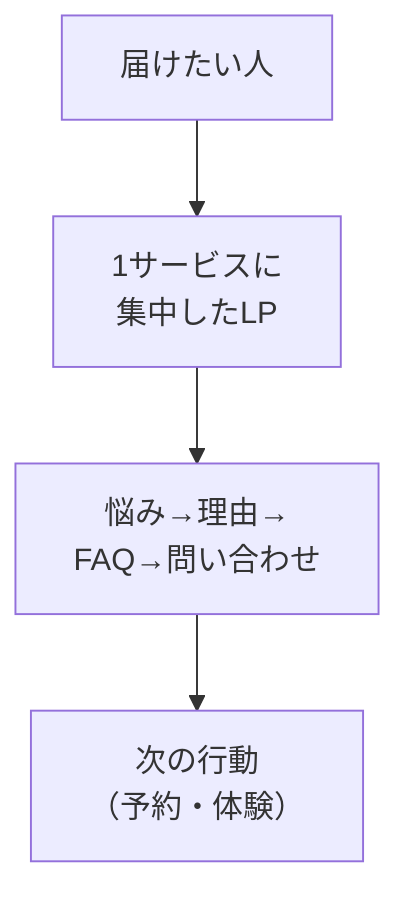

# LPとは何か

## たとえ話

> 駅前の大きな掲示板に、あらゆるお知らせがびっしり貼られていると、いちばん知りたいことがどこにあるのか、かえって見つけられない。一方、入口に「本日はこちら」と一枚だけ案内が出ていると、迷わずそこへ向かえる。情報は、多ければ伝わるわけではない。一つに絞った一枚のほうが、まっすぐ届くことがある。
>
> Webのページも、これとよく似ている。あれもこれもと詰め込んだページより、一つのサービスに絞って伝える一枚のほうが、見た人は迷わない。これがLP（ランディングページ）だ。日々の案内は流れて消えやすいが、LPにまとめておけば、いつでも同じ説明を渡せる。だから今日は、難しい作り方の前に、LPが何のための一枚なのかをつかんでおく。

## 今日のゴール

LPが何のためのものか説明できる。4択チェックに答える。

## 前提確認

- すでにできる前提：第12章05で `lp-draft.md` のたたきがある（なくても読んで進められる）
- まだ知らなくてよいこと：Next.jsのコード、デザインの専門用語

## このテーマで伸ばす力

**判断する力** — いつLPが必要か、何を載せるかを選ぶ力です。

## 学びの段階

今日の完了条件は **「わかった」** です。4択に答え、答えページで確認できればOKです。

## なぜ大事か

Rebuild AI Guild の初期必修の到達点のひとつが **LP・自社HP公開** です。プロ級を目指さず、**公開できる最低限の1ページ** を作ります。検索や紹介で渡せる「住所」のようなものです。

## 読んで学ぶ

### LPとホームページの違い（ざっくり）

| | LP | いろいろ載せるサイト |
|---|---|---|
| 目的 | 1サービスに集中 | お店全体の情報 |
| 例 | いちばん依頼の多いサービス専用 | 事業全体・全サービス |
| 今日の目標 | まずこちら | 後からでもよい |

### 載せる典型セクション

1. いちばん上：何のサービスか（ヒーロー）
2. 悩み・対象者
3. 選ばれる理由
4. 料金の考え方（具体数字は自分で確認）
5. FAQ
6. お問い合わせ・予約導線

全部がなくても公開できます。第14章では **最低限そろえる** を目指します。

### 図解

**わからないまま進まないチェック**：Web用語が不安 → 今日は「1サービス1ページの案内板」と思えばOKです。

## 4択チェック

1. LPの説明として最も近いのはどれですか？  
   A. 社内のお客さまの記録  
   B. 1つのサービスに集中して伝える1枚のWebページ  
   C. パソコンのウイルス対策ソフト  
   D. 毎日書く日記アプリ

2. 最初にLPにするとよい例として、最も近いのはどれですか？  
   A. すべてのサービスを詰め込んだ百科事典のようなページ  
   B. いちばん依頼の多いサービス1つの専用ページ  
   C. スタッフの私的な日記  
   D. お客さまの本名一覧

3. 第14章のゴールとして最も近いのはどれですか？  
   A. プロ級のデザインを必ず達成する  
   B. 公開できる最低限のLPを1つ作る  
   C. 大規模アプリを一から開発する  
   D. 外部サービスの反応だけを増やす

答え合わせはこちら：  
[答えを見る](../../答え/第14章-LP公開/01-LPとは何か-答え.md)

## できたらOK

- LPを自分の言葉で1文説明できる
- 4択チェックに答えた

## つまずいたら

**躓いたら戻る先**：[第12章 LP構成案](../第12章-Cursor-AI/05-LP構成案とサービス説明文を作る.md)

| つまずき | 対処 |
|---|---|
| 自分にLPが不要 | 予約・体験の「説明用URL」として考える |
| 載せる内容が多すぎる | 1サービス・5セクションまでに絞る |

## 今日の成果物

- 4択チェックの回答（答えページで確認）

## 問い

あなたの仕事で、**いまいちばんURLで渡したい説明**は何でしょうか。  
流れて消える案内だけでは足りないと感じる点は、どこでしょうか。
