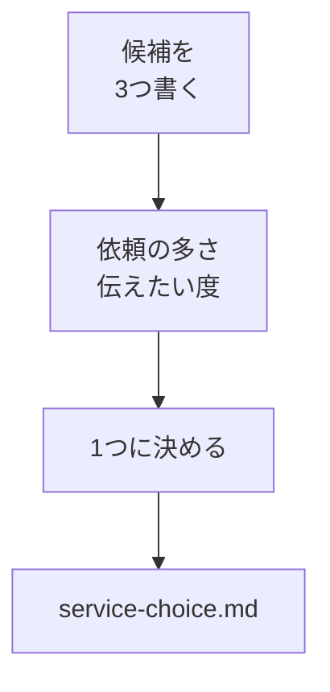

# サービスを1つ選ぶ

## たとえ話

> 旅の荷造りで「あれもこれも要るかもしれない」と詰め込んでいくと、かばんは重くなるばかりで、結局いちばん使うものが奥に埋もれてしまう。本当に必要な一つに絞れた人ほど、身軽に動ける。全部を持っていこうとするほど、かえって最初の一歩が出なくなる。
>
> LPづくりも、これとよく似ている。「うちのサービスを全部載せたい」と欲張るほど、ページは重くなり、何週間も止まってしまう。まずは、いちばん伝えたい、あるいは依頼の多いサービスを一つだけ選ぶ。一つに絞れれば、見出しも写真もFAQの中身も、自然と決まっていく。だから今日は、候補をいくつか書き出したうえで、思いきって一つに決めるところまで進む。

## 今日のゴール

LPの対象サービスを1つ決め、`lp-site用メモ/service-choice.md` に理由つきで書く。

## 前提確認

- すでにできる前提：第14章01を読んだ、仕事フォルダがある
- まだ知らなくてよいこと：デザイン、コード

## このテーマで伸ばす力

**判断する力** — 全部は載せず、いま一番効く1つを選ぶ力です。

## 学びの段階

今日の完了条件は **「できる」** です。サービス名と選んだ理由が書けていればOKです。

## なぜ大事か

サービスが決まると、見出し・写真・FAQの中身が決まります。第12章の `lp-draft.md` とも揃えやすくなります。

## 図解



## 手順

### ステップ1：候補を3つ書く（10分）

`lp-site用メモ/service-choice.md` を作り、次を埋めます。これは後で `~/Documents/Rebuild練習用/lp-site` に入れるための下書きです。

```markdown
# LP対象サービスの選定

## 候補（3つまで）
1. 
2. 
3. 

## 選ぶ基準
- いま問い合わせ・予約が多い
- 説明が長くて伝わりにくい
- これから増やしたい

## 決定（1つ）
- サービス名：
- 選んだ理由（2行）：
```

例：いちばん依頼の多いサービス / これから増やしたいサービス / 説明に時間がかかるサービス　を3つ書き出します。

### ステップ2：1つに決める（10分）

3つのうち、基準にいちばん合う **1つ** に丸をつけます。決めきれないときは「今月いちばん忙しいサービス」を選んでOKです。

**わからないまま進まないチェック**：どれも同じに感じる → いちばん説明を繰り返しているサービスを選べばOKです。

### ステップ3：AGENTS.mdと揃える（5分）

`@AGENTS.md` を読み、選んだサービスが方針と矛盾していないか確認します。矛盾があれば、サービスかAGENTSのどちらかを1行直します。

### ステップ4：lp-draft.mdを更新（5分）

第12章の `lp-draft.md` のタイトル行を、今日決めたサービス名に合わせて直し、保存します。

## できたらOK

- `service-choice.md` にサービス1つと理由がある
- `lp-draft.md` のタイトルが揃っている

## つまずいたら

**躓いたら戻る先**：[01 LPとは何か](./01-LPとは何か.md)  
[第12章 LP構成案](../第12章-Cursor-AI/05-LP構成案とサービス説明文を作る.md)

## 今日の成果物

- `lp-site用メモ/service-choice.md`

## 問い

選ばなかった2つは、**あとで別LPにする価値**がありそうでしょうか。  
この1つを選んで、誰がいちばん喜びそうでしょうか。
