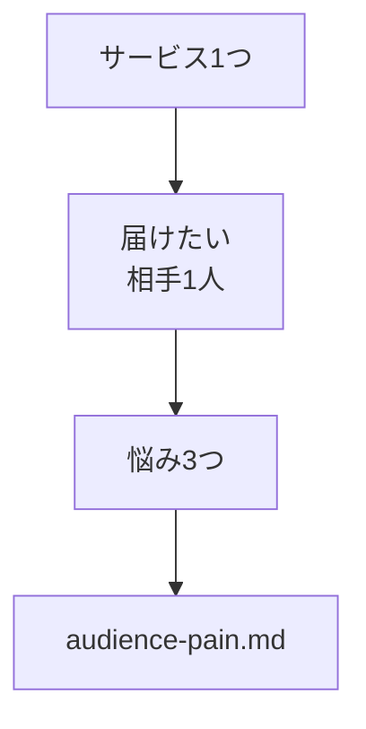

# 届けたい相手と悩みを整理する

## たとえ話

> 大勢に向かって「みなさん」と呼びかける挨拶は、丁寧でも、なぜか心に残りにくい。一方、目の前の一人に「あなたのこの悩み、わかります」と語りかけると、不思議と周りの人の耳にも届く。全員に当てようとすると誰にも当たらず、一人にしっかり当てると、かえって多くの人に響く。伝えることには、そんな逆説がある。
>
> LPの言葉も、これとよく似ている。「みんなに届けたい」と書いた案内は、結局だれの胸にも刺さらないことが多い。だれの、どんな悩みに向けた一枚なのかがはっきりしているほど、文案づくりは楽になり、読んだ人も「自分のことだ」と感じてくれる。だから今日は、届けたい相手を一人だけ思い描き、その人がかかえる悩みを書き出してみる。相手が定まれば、書くべき言葉のほうから見えてくるからだ。

## 今日のゴール

`lp-site用メモ/audience-pain.md` に、届けたい相手1人分の像と悩み3つを書く。

## 前提確認

- すでにできる前提：第14章02でサービス1つを決めた
- まだ知らなくてよいこと：ペルソナ分析の専門用語

## このテーマで伸ばす力

**整理力・相談力** — 読み手の悩みを言葉にし、LPの材料にする力です。

## 学びの段階

今日の完了条件は **「できる」** です。相手の像と悩み3つが書けていればOKです。

## なぜ大事か

LPの「悩み」セクションは、ここで書いた内容がそのまま使えます。AIに実装を頼むときも、読み手がぶれません。

## 図解



## 手順

### ステップ1：ファイルを作る（15分）

`lp-site用メモ/audience-pain.md`：

```markdown
# 届けたい相手と悩み

## サービス（再掲）
（service-choice.md からコピー）

## 届けたい相手（1人分でよい）
- 年代・立場：
- 状況：
- いまの行動：

## 相手の悩み（3つ）
1. 
2. 
3. 

## このLPで安心してほしいこと（1行）
```

記入例：

- 40代、初めて利用する、ネットでお店を探している
- 悩み：仕上がりのイメージがわかない、時間はどれくらいか、料金のイメージがわからない

**わからないまま進まないチェック**：相手が思い浮かばない → 最近の相談が多かったお客さまを1人想像すればOKです。実名は書きません。

### ステップ2：AIに足りない悩みを1つ提案してもらう（10分）

```text
@audience-pain.md と @AGENTS.md を読んで、
悩みのリストに足すとよい項目を1つだけ提案してください。
個人名は使わないでください。
```

採用するか自分で判断し、必要なら1つ追加します。

### ステップ3：lp-draft.mdに反映（5分）

`lp-draft.md` の構成案に「悩み」セクションがなければ足し、悩み1つをメモとして書き込みます。

## できたらOK

- 相手の像（年代・状況）が書いてある
- 悩みが3つある
- 実名・お客さまの記録の内容を書いていない

## つまずいたら

**躓いたら戻る先**：[02 サービスを1つ選ぶ](./02-サービスを1つ選ぶ.md)

| つまずき | 対処 |
|---|---|
| 悩みが思いつかない | 来店・体験前に聞かれる質問TOP3を書く |
| 相手が広すぎる | 「1人分」に絞る |

## 今日の成果物

- `lp-site用メモ/audience-pain.md`

## 問い

書いた悩みのうち、**あなたがいちばん自信を持って答えられる**のはどれでしょうか。  
LPのいちばん上に大きく出すとよい悩みは、どれでしょうか。
