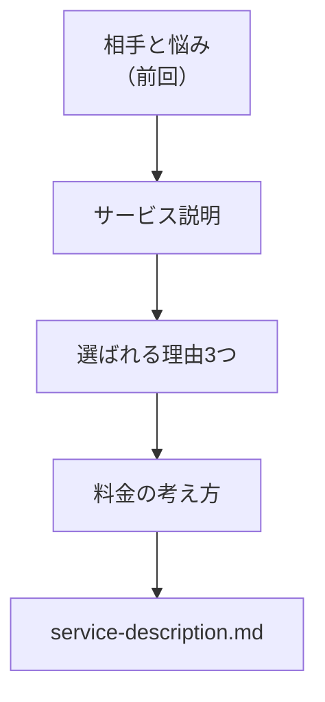

# サービス説明・選ばれる理由・料金を書く

## たとえ話

> 道具を売る小さな棚を思い浮かべてほしい。同じ品物でも、ただ箱が積まれているだけの棚と、「これは何に使う道具で、ほかと比べてここが違い、目安はこれくらい」と短い札が添えられた棚とでは、手に取りやすさがまるで違う。値段や違いがわからないものを、人はなかなか選べない。説明とは、相手の「迷い」を一つずつ減らしてあげる作業だ。

> サービスの案内も、これとよく似ている。「いいサービスです」とだけ書いても、読んだ人は何が自分に合うのか判断できない。何をしてくれるのか、なぜここを選ぶといいのか、いくらくらいかかるのか。この三つがそろうと、読み手は安心して次の一歩を踏み出せる。だから今日は、前回そろえた相手と悩みをもとに、サービス説明・選ばれる理由・料金の考え方を、自分の言葉で書き出してみる。

## 今日のゴール

`lp-site用メモ/service-description.md` に、サービス説明・選ばれる理由3つ・料金の考え方を書く。

## 前提確認

- すでにできる前提：第14章03で `audience-pain.md`（相手と悩み）を書いた
- まだ知らなくてよいこと：コピーライティングの専門用語、デザイン

## このテーマで伸ばす力

**整理する力** — サービスの中身を、選ぶ人にわかる言葉に整える力です。

## 学びの段階

今日の完了条件は **「できる」** です。説明・理由3つ・料金の考え方が書けていればOKです。

## なぜ大事か

LPの真ん中は、この「説明・選ばれる理由・料金」でできています。ここが言葉になっていれば、後でAIに実装を頼むときも、そのまま材料として渡せます。逆にここが空っぽだと、見た目だけ整っても中身が伝わりません。

## 読んで学ぶ

### 3つは「相手の迷い」に答えるもの

- **サービス説明**：何をしてくれるのか（相手が「これは何？」に答える）
- **選ばれる理由**：なぜここを選ぶといいのか（相手が「他とどう違う？」に答える）
- **料金の考え方**：いくらくらいか（相手が「予算は合う？」に答える）

具体的な金額は、必ず自分で確認した数字を書きます。あいまいなら「目安」「要相談」でもかまいません。無理に安く見せる必要はありません。

### 図解



**わからないまま進まないチェック**：理由が思いつかない → 「お客さまからよく言われる感謝の言葉」を思い出すと、選ばれる理由のヒントになります。

## 手順

### ステップ1：ファイルを作る（15分）

Cursorの左の一覧から `lp-site用メモ` フォルダを開き、`service-description.md` という新しいファイルを作ります。下のひな形を貼り付けて、空欄を埋めます。

```markdown
# サービス説明・選ばれる理由・料金

## サービス（再掲）
（service-choice.md からコピー）

## サービス説明（2〜3行）
- 何をするか：
- 相手が得られること：

## 選ばれる理由（3つ）
1. 
2. 
3. 

## 料金の考え方
- 目安：
- 含まれるもの：
- 備考（要相談など）：
```

記入例（職業は名指ししません）：

- 説明：はじめての方の不安を減らし、当日の流れを丁寧に案内します
- 理由：①初回の相談がていねい ②無理なおすすめをしない ③予約が取りやすい
- 料金：目安〇〇円〜／含まれるもの／詳しくは要相談

### ステップ2：AIに表現をやさしくしてもらう（10分）

書けたら、Cursorのチャットに次のように頼みます。

```text
@service-description.md と @AGENTS.md を読んで、
専門用語をやさしい言葉に1〜2か所だけ言い換える案を出してください。
誇張した表現や「絶対」などの言い切りは使わないでください。
```

> スクショ案内：AIの返答が出た画面を1枚撮っておくと、後で見返せます。

採用するかは自分で判断します。すべて受け入れる必要はありません。

### ステップ3：lp-draft.mdに反映（5分）

第12章の `lp-draft.md` に「サービス説明」「選ばれる理由」「料金」のメモを書き足して保存します。

## できたらOK

- サービス説明が2〜3行ある
- 選ばれる理由が3つある
- 料金の考え方が書いてある（目安・要相談でも可）

## つまずいたら

**躓いたら戻る先**：[03 届けたい相手と悩み](./03-届けたい相手と悩みを整理する.md)

Discordで次のように聞いてください。

```text
【今やっている教材】第14章04 サービス説明

【詰まったところ】

【試したこと】

【スクショやエラー文】

【どうなればOKか】
```

| つまずき | 対処 |
|---|---|
| 選ばれる理由が3つ出ない | まず1つでOK。残りは後日でもよい |
| 料金を出すのが不安 | 「目安」「要相談」と書いておく |

## 今日の成果物

- `lp-site用メモ/service-description.md`

## 問い

あなたのサービスで、**お客さまがいちばん最後まで迷う点**は何でしょうか。  
その迷いに、今日の3つのどれが答えられそうでしょうか。
