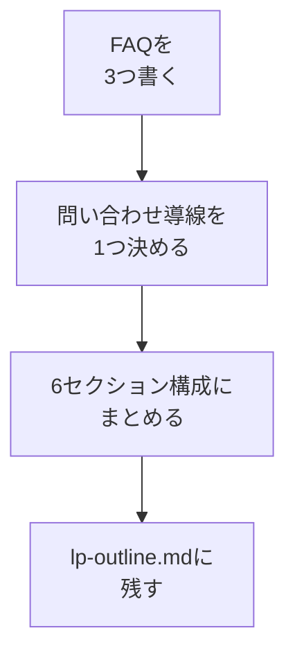

# FAQと問い合わせ導線を決めてLP構成案にする

## たとえ話

> 初めて訪れた場所で、入口に「よくあるご質問」と書かれた小さな案内があると、ふっと肩の力が抜ける。聞きたかったことがそこに先回りして書いてあると、人は安心して中へ進める。そして、いざ進もうと思ったとき、「こちらへどうぞ」と次の入口がはっきり示されていれば、迷わず一歩を踏み出せる。不安を消す案内と、進む先を示す案内。この二つはいつも対になっている。

> サービスの案内も、これとよく似ている。どれだけ説明がよくても、最後に「で、どこから申し込めばいいの？」がわからなければ、人はそっと離れていく。だから、よくある質問で不安を消し、問い合わせや予約の入口をはっきり示す。この二つがそろって、はじめて案内は「行動できる一枚」になる。今日は、ここまで書いた材料を一つの構成案にまとめ、AIに渡せる形に整える。

## 今日のゴール

`lp-site用メモ/lp-outline.md` に、FAQ3つ・問い合わせ導線・LP構成案（セクションの並び）をまとめる。

## 前提確認

- すでにできる前提：第14章04までで、相手・悩み・説明・理由・料金がそろっている
- まだ知らなくてよいこと：フォームの作り方、コード

## このテーマで伸ばす力

**整理する力・判断する力** — バラバラの材料を、1枚の流れに組み立てる力です。

## 学びの段階

今日の完了条件は **「できる」** です。FAQ・問い合わせ導線・構成案が1ファイルにまとまればOKです。

## なぜ大事か

ここで作る「構成案（lp-outline.md）」が、次のパートでAIに渡す設計図になります。設計図があると、AIは迷わず初期実装を作れます。逆に設計図がないまま頼むと、何度も作り直すことになります。

## 読んで学ぶ

### 問い合わせ導線は「無理なく続けられる形」を選ぶ

最初から高度なフォームは要りません。次のどれか1つで十分です。

- メールアドレスを載せる
- 電話番号を載せる
- すでに使っている予約・問い合わせページのURLを載せる
- 既存の問い合わせフォームへ誘導する

### LP構成案（並び順の例）



全部そろわなくても公開できます。まずはこの並びを「目次」として用意します。

**わからないまま進まないチェック**：FAQが思いつかない → 申し込み前に毎回聞かれる質問を3つ書けばOKです。

## 手順

### ステップ1：FAQを3つ書く（10分）

`lp-site用メモ` フォルダに `lp-outline.md` を新規作成し、まずFAQから埋めます。このファイルは第14章09で `~/Documents/Rebuild練習用/lp-site` にコピーして使います。

```markdown
# LP構成案（outline）

## よくある質問（FAQ・3つ）
- Q1：
  A1：
- Q2：
  A2：
- Q3：
  A3：
```

質問は「申し込み前に毎回聞かれること」から選ぶと、外しません。

### ステップ2：問い合わせ導線を1つ決める（5分）

同じファイルに追記します。実際に使える連絡先を1つだけ書きます。

```markdown
## 問い合わせ・予約導線（1つでよい）
- 方法（メール／電話／既存URL／問い合わせフォーム）：
- 連絡先・URL：
- ボタンに出す言葉（例：無料で相談する）：
```

### ステップ3：構成案にまとめる（10分）

これまでのファイル（service-choice / audience-pain / service-description）から要点を集め、並び順に沿って1枚に並べます。

```markdown
## 構成（上から順に）
1. ヒーロー：サービス名＋ひとことキャッチ
2. 悩み・対象者：（audience-pain.md から）
3. 選ばれる理由：（service-description.md から3つ）
4. 料金の考え方：（service-description.md から）
5. FAQ：（上の3つ）
6. 問い合わせ：（上で決めた導線）
```

> スクショ案内：完成した `lp-outline.md` の全体が見える状態で1枚撮っておくと、次のパートで確認しやすくなります。

### ステップ4：AIに抜け漏れを確認してもらう（5分）

```text
@lp-outline.md と @AGENTS.md を読んで、
公開前に1つだけ足りない要素があれば指摘してください。
個人情報や実名は使わないでください。
```

指摘は参考程度に。今日は構成案が1枚になっていれば十分です。

## できたらOK

- FAQが3つある
- 問い合わせ導線が1つ決まっている
- 6セクションの構成案が1ファイルにまとまっている

## つまずいたら

**躓いたら戻る先**：[04 サービス説明・選ばれる理由・料金](./04-サービス説明・選ばれる理由・料金を書く.md)

Discordで次のように聞いてください。

```text
【今やっている教材】第14章05 FAQと構成案

【詰まったところ】

【試したこと】

【スクショやエラー文】

【どうなればOKか】
```

| つまずき | 対処 |
|---|---|
| FAQが3つ出ない | まず1つでOK。残りは公開後でもよい |
| 連絡先を公開したくない | 既存の問い合わせページURLを使う |

## 今日の成果物

- `lp-site用メモ/lp-outline.md`（LP構成案）

## 問い

あなたのサービスで、**問い合わせの一歩手前で人が止まる理由**は何でしょうか。  
その不安を消すFAQを、いちばん上に置くとしたらどれでしょうか。
