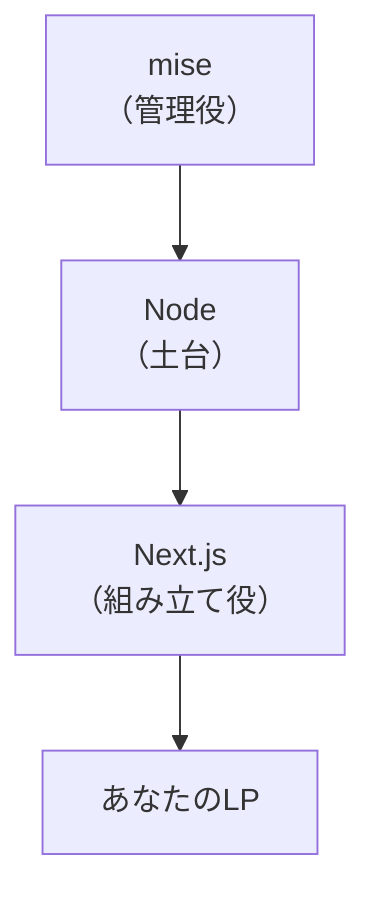

# Node・mise・Next.jsをざっくり知る

## たとえ話

> 家を建てるとき、まず土地を整え、電気や水道といった土台を通し、その上に建物を組み上げていく。住む人は、配線の仕組みを一つひとつ理解していなくても、スイッチを押せば明かりがつく暮らしができる。大事なのは、土台と建物の役割が分かれていて、それぞれが噛み合っていることだ。役割さえつかめれば、全体は驚くほど見通しがよくなる。

> Webページを作るときの道具立ても、これとよく似ている。土台を動かす仕組み、その土台のバージョンを整える管理役、その上でページを組み立てる枠組み。名前は聞き慣れなくても、役割で見れば「土台・管理役・組み立て役」と整理できる。中身を一から理解する必要はない。今日は、これから使う三つの道具が、それぞれ何の係なのかをつかんでおく。それだけで、次の作業の不安がぐっと減る。

## 今日のゴール

Node・mise・Next.jsが、それぞれ何の役割かをざっくり説明できる。4択チェックに答える。

## 前提確認

- すでにできる前提：第9章でターミナルを少し触った、第14章05まで構成案がある
- まだ知らなくてよいこと：プログラミング言語の文法、サーバーの専門知識

今日は `Node`、`mise`、`Next.js` の名前を覚えきらなくて大丈夫です。**それぞれの役割をざっくり区別できる** ところまでで十分です。

## このテーマで伸ばす力

**判断する力** — 道具の役割を知り、必要なときに何を使うか選べる力です。

## 学びの段階

今日の完了条件は **「わかった」** です。4択に答え、答えページで確認できればOKです。

## なぜ大事か

次のテーマから、実際に道具を入れてLPを作り始めます。役割を先につかんでおくと、エラーが出たときも「どの係の話か」が見当をつけられます。コードを書けるようになる必要はありません。役割がわかれば十分です。

## 読んで学ぶ

### 3つの道具の役割（ざっくり）

| 名前 | 役割 | 家にたとえると |
|---|---|---|
| Node（ノード） | Web用の道具を動かす土台 | 電気・水道の土台 |
| mise（ミーズ） | Nodeのバージョンを整える管理役 | 設備を点検する管理人 |
| Next.js（ネクスト） | LP（ページ）を組み立てる枠組み | 建物そのもの |

順番に言うと、**miseがNodeを整え、Nodeの上でNext.jsが動き、その上にあなたのLPができる** という重なりです。

### 図解



### なぜ mise を使うのか

Nodeにはバージョン（年式のようなもの）があり、人によって違うと不具合の元になります。miseは「このプロジェクトではこの年式のNode」と自動でそろえてくれます。最初に整えておくと、後でつまずきにくくなります。

**わからないまま進まないチェック**：3つの名前が覚えられない → 「管理役・土台・組み立て役」の3つの係だけ覚えればOKです。

## 4択チェック

1. Nodeの役割として最も近いのはどれですか？  
   - A. ページのデザインを自動で美しくする道具
   - B. Web用の道具を動かす「土台」
   - C. お客さまの記録を保存する金庫
   - D. 外部サービスに自動送信するアプリ

2. miseの役割として最も近いのはどれですか？  
   - A. Nodeのバージョン（年式）を整える「管理役」
   - B. 写真をきれいに加工する道具
   - C. インターネットの回線速度を上げる装置
   - D. メールを自動返信する仕組み

3. Next.jsの役割として最も近いのはどれですか？  
   - A. パソコンのウイルスを駆除する
   - B. LP（ページ）を組み立てる「枠組み」
   - C. 料金を自動で計算する電卓
   - D. 動画を編集する専用ソフト

答え合わせはこちら：  
[答えを見る](../../答え/第14章-LP公開/06-Node・mise・Next.jsをざっくり知る-答え.md)

## できたらOK

- 3つの道具の役割を、自分の言葉で1つずつ言える
- 4択チェックに答えた

## つまずいたら

**躓いたら戻る先**：[第9章 ターミナルの基本](../第09章-ターミナル基礎/01-ターミナルを開く.md)

Discordで次のように聞いてください。

```text
【今やっている教材】第14章06 Node・mise・Next.js

【詰まったところ】

【試したこと】

【スクショやエラー文】

【どうなればOKか】
```

| つまずき | 対処 |
|---|---|
| 用語が多くて不安 | 今日は「管理役・土台・組み立て役」だけでOK |
| 仕組みを完全に理解したい | 役割がわかれば次に進めます。深掘りは後で |

## 今日の成果物

- 4択チェックの回答（答えページで確認）

## 問い

あなたの仕事にも、**目立たないけれど全体を支える「土台」や「管理役」**があるとしたら、それは何でしょうか。  
役割で物事を整理すると、わからなさはどう変わるでしょうか。
