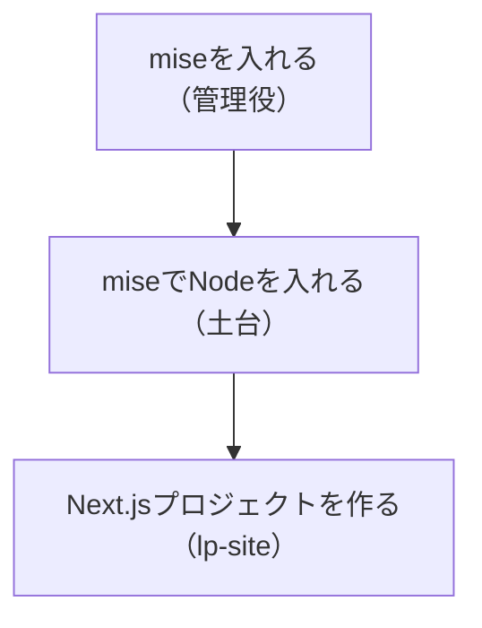

# miseでNodeを入れてNext.jsプロジェクトを作る

## たとえ話

> 新しく何かを作り始める前に、人はまず作業台を用意する。木工なら台と工具を並べ、料理なら調理台と道具をそろえる。台が整っていないまま手を動かすと、途中で道具が足りないと気づき、何度も中断することになる。最初に少し手間をかけて場を整えておくほうが、結局はまっすぐ進める。準備は遠回りに見えて、いちばんの近道だ。

> ページづくりも、これとよく似ている。いきなり中身を書き始めるより、まず「土台」を整え、その上に作業場（プロジェクト）を一つ用意する。一度作ってしまえば、あとはその場の中で安心して試せる。今日は、前回役割を知った道具を実際に入れ、あなたのLP用の作業場を一つ立ち上げる。コマンドは少し出てくるが、一行ずつ貼って実行するだけで進める。意味を全部覚える必要はない。

## 今日のゴール

miseでNodeを用意し、`lp-site` という名前のNext.jsプロジェクトを1つ作る。
標準の作業場所は `~/Documents/Rebuild練習用/lp-site` です。

## 前提確認

- すでにできる前提：第14章06で道具の役割を知った、第9章でターミナルを開ける
- まだ知らなくてよいこと：コマンドの細かい意味、コードの中身

今日は `mise`、`Node`、`Next.js` の名前を覚えきらなくて大丈夫です。画面の指示どおりに進め、止まったらエラー文を共有できれば十分です。

## このテーマで伸ばす力

**作る力** — 自分の作業場を、自分の手で立ち上げる力です。

## 学びの段階

今日の完了条件は **「できる」** です。`lp-site` フォルダが作られていればOKです。

## なぜ大事か

ここで作る `lp-site` が、これから育てるLPの本体です。一度作れば、次回からはこの中で見た目や文言を整えていきます。今日は中身を書かず、「箱」を用意するところまでで十分です。

## 読んで学ぶ

### 今日の流れ（3段階）



コマンドは、ターミナルに1行ずつ貼り付けて、Enterで実行します。エラーが出ても慌てず、画面の文をコピーしておけば後で相談できます。

**わからないまま進まないチェック**：どこで実行するか不安 → 第9章で開いた「ターミナル」に貼り付ければOKです。

## 手順

### ステップ1：練習用フォルダに移動する（3分）

ターミナルを開き、Rebuild用の練習フォルダへ移動します。まだない場合も、次のコマンドで作れます。

```bash
mkdir -p ~/Documents/Rebuild練習用
cd ~/Documents/Rebuild練習用
pwd
ls
```

`pwd` の結果に `/Documents/Rebuild練習用` が含まれていればOKです。`ls` では、今このフォルダに何があるかを確認します。

> スクショ案内：`pwd` と `ls` の結果が表示された画面を1枚撮っておくと安心です。

### ステップ2：miseを入れる（5分）

次の1行を貼り付けて実行します（Macの場合）。

**実行前に必ず確認してください。**

- 公式URLが `https://mise.run` になっている
- 教材外の記事や動画で見た、似たコマンドを貼らない
- `curl ... | sh` は外部のインストール操作です。不安なら実行前にDiscordでスクショを共有して止まってください

```bash
curl https://mise.run | sh
```

入れ終わったら、ターミナルを一度閉じて開き直します。`mise --version` と打って番号が出れば成功です。番号が出ないときは、画面の案内文をコピーしてDiscordへ。

### ステップ3：miseでNodeを入れる（5分）

```bash
mise use --global node@lts
```

`node --version` と打って、`v` から始まる番号が出れば、土台（Node）が入っています。

### ステップ4：Next.jsプロジェクトを作る（10分）

`~/Documents/Rebuild練習用` にいることを確認して、次を実行します。

```bash
pwd
npx create-next-app@latest lp-site
```

途中でいくつか質問が出ます。表示が少し違うことがありますが、迷ったら次の表に近い回答で進めます。

| 質問例 | 回答 |
|---|---|
| Would you like to use TypeScript? | Yes |
| Would you like to use ESLint? | Yes |
| Would you like to use Tailwind CSS? | Yes |
| Would you like your code inside a `src/` directory? | No |
| Would you like to use App Router? | Yes |
| Would you like to use Turbopack? | No（迷ったら表示の推奨でOK） |
| Would you like to customize the import alias? | No |

完了すると `lp-site` というフォルダができます。

> スクショ案内：作成完了のメッセージが出た画面と、`lp-site` フォルダができた一覧を1枚ずつ撮っておきます。

### ステップ5：できたか確認する（2分）

```bash
ls lp-site
```

`package.json` や `app` などの名前が並んで表示されれば、作業場の完成です。

## 15分版 / 30分版

- **15分版**：`mise --version` と `node --version` で番号が出るところまでで完了です。Next.js作成は次回でOKです。
- **30分版**：`~/Documents/Rebuild練習用/lp-site` ができ、`ls lp-site` で `package.json` や `app` が見えるところまで進みます。
- **今日はここで止まってOK**：インストールや対話質問で不安になったら、実行前または止まった画面をスクショしてDiscordへ。先に進めなくても、確認できたところまでが成果です。

## できたらOK

- `mise --version` と `node --version` で番号が出る
- `lp-site` フォルダができ、中に複数のファイルがある

## つまずいたら

**躓いたら戻る先**：[第9章 ターミナルの基本](../第09章-ターミナル基礎/01-ターミナルを開く.md)

Discordで次のように聞いてください。

```text
【今やっている教材】第14章07 プロジェクトを作る

【詰まったところ】（どのコマンドで止まったか）

【試したこと】

【スクショやエラー文】（画面の文をそのまま貼る）

【どうなればOKか】
```

| つまずき | 対処 |
|---|---|
| `command not found` と出る | ターミナルを閉じて開き直してから再実行 |
| 質問が多くて不安 | 迷ったら推奨のままEnterでOK |
| 途中で止まった | エラー文をコピーしてDiscordへ |

## 今日の成果物

- `~/Documents/Rebuild練習用/lp-site` プロジェクト（フォルダ一式）

## 問い

新しいことを始める前の「準備」を、あなたはふだん十分に取れているでしょうか。  
今日のように先に場を整えると、その後の進み方はどう変わりそうでしょうか。
