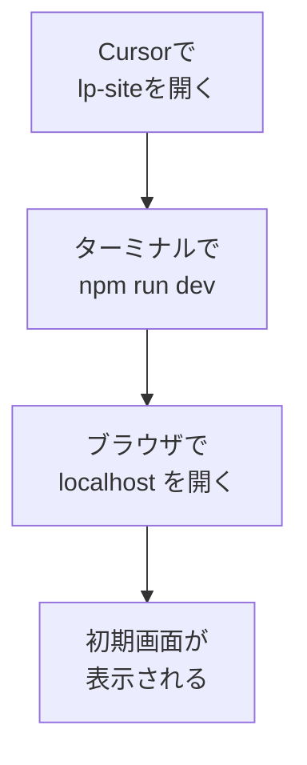

# Cursorで開いて開発サーバーを起動する

## たとえ話

> 料理を作っている最中、味見をせずに最後まで突き進む人はいない。ひと口ためし、塩を足し、また確かめる。その小さな確認の繰り返しが、仕上がりを安心できるものにしていく。作りながら確かめられる状態をつくることは、上手につくることと同じくらい大切だ。手元の鍋が見えていないまま料理を続けるのは、誰にとっても不安なものだ。

> ページづくりにも、同じ「味見」の仕組みがある。作りかけのページを、その場ですぐ画面で見られるようにしておくのだ。これを開発サーバーと呼ぶ。一度立ち上げておけば、文章を直すたびに結果がすぐ画面に映る。今日は、前回作った作業場をCursorで開き、この「味見できる状態」を用意する。難しい操作はなく、ボタンと一行のコマンドで整う。

## 今日のゴール

`lp-site` をCursorで開き、開発サーバーを起動して、ブラウザで初期画面を表示する。
標準の作業場所は `~/Documents/Rebuild練習用/lp-site` です。

## 前提確認

- すでにできる前提：第14章07で `lp-site` を作った、Cursorを開ける（第8章）
- まだ知らなくてよいこと：コードの編集、サーバーの仕組み

## このテーマで伸ばす力

**作る力・続ける力** — 作りながら確かめる環境を、自分で整える力です。

## 学びの段階

今日の完了条件は **「できる」** です。ブラウザにNext.jsの初期画面が出ればOKです。

## なぜ大事か

開発サーバーが動いていると、文章や見た目を直すたびに、結果がすぐ画面に反映されます。この「すぐ見える」状態が、これからの作業をぐっと楽にします。次のテーマ以降は、ずっとこの画面を見ながら進めます。

## 読んで学ぶ

### 今日の流れ



`localhost`（ローカルホスト）とは、自分のパソコンの中だけで見られる住所のことです。まだ世界には公開されていません。安心して試せます。

**わからないまま進まないチェック**：公開されてしまわないか不安 → `localhost` は自分のパソコンの中だけ。外からは見えません。

## 手順

### ステップ1：Cursorで lp-site を開く（5分）

Cursorを起動し、上のメニューから **「File」→「Open Folder…」** を選びます。第14章07で作った `~/Documents/Rebuild練習用/lp-site` フォルダを選んで開きます。

> スクショ案内：左側にファイル一覧（`app` や `package.json`）が並んだ画面を1枚撮っておきます。

### ステップ2：ターミナルを開く（3分）

Cursorの上メニューから **「Terminal」→「New Terminal」** を選びます。画面の下にターミナルが開きます。次の2つで、`lp-site` の中にいるか確認します。

```bash
pwd
ls
```

`pwd` に `/Documents/Rebuild練習用/lp-site` が含まれ、`ls` に `package.json` が見えればOKです。違う場所なら、いったん止まってフォルダを開き直してください。

### ステップ3：開発サーバーを起動する（5分）

下のターミナルに次を貼り付けて実行します。

```bash
npm run dev
```

しばらくすると、`Local: http://localhost:3000` のような表示が出ます。これが「味見用の住所」です。

> スクショ案内：`localhost:3000` の行が表示されたターミナル画面を1枚撮っておきます。

### ステップ4：ブラウザで開く（3分）

ブラウザ（SafariやChrome）を開き、アドレス欄に `http://localhost:3000` と入力してEnterを押します。Next.jsの初期画面が表示されれば成功です。

`localhost:3000` の文字を、Cursorのターミナル上で Command を押しながらクリックすると、そのまま開けることもあります。

### ステップ5：止めたいとき（2分）

作業を終えるときは、ターミナルをクリックして **Control + C** を押すと、サーバーが止まります。次に使うときは、またステップ3を実行します。

## 15分版 / 30分版

- **15分版**：Cursorで `~/Documents/Rebuild練習用/lp-site` を開き、`pwd` と `ls` で場所を確認できれば完了です。
- **30分版**：`npm run dev` を実行し、`localhost:3000` で初期画面を見られれば完了です。
- **今日はここで止まってOK**：開発サーバーが起動しない場合は、エラー文をコピーし、ターミナル画面のスクショをDiscordへ送れれば完了です。無理に何度も同じコマンドを打たなくて大丈夫です。

## できたらOK

- Cursorで `lp-site` が開けている
- ブラウザで `localhost:3000` にNext.jsの初期画面が出る

## つまずいたら

**躓いたら戻る先**：[07 プロジェクトを作る](./07-miseでNodeを入れてNext.jsプロジェクトを作る.md)

Discordで次のように聞いてください。

```text
【今やっている教材】第14章08 開発サーバー

【詰まったところ】

【試したこと】

【スクショやエラー文】

【どうなればOKか】
```

| つまずき | 対処 |
|---|---|
| `npm run dev` でエラー | 一覧に `package.json` があるか確認。なければフォルダを開き直す |
| 画面が真っ白 | 数秒待って再読み込み。`localhost:3000` のつづりを確認 |
| ポートが使用中と出る | 表示された別の番号（例 3001）でブラウザを開く |
| 何度やっても起動しない | エラー文をコピーしてDiscordへ。今日は相談材料を作れればOK |

## 今日の成果物

- ブラウザに表示されたNext.js初期画面（スクショ）

## 問い

作りながら確かめられる状態は、あなたのふだんの仕事にもあるでしょうか。  
「すぐ確認できる」と、人はなぜ安心して手を動かせるのでしょうか。
