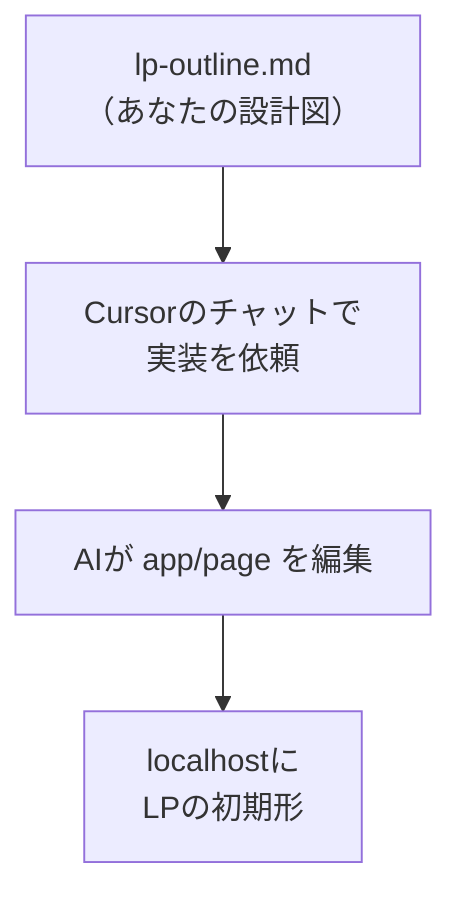

# LP構成案を渡してAIに初期実装させる

## たとえ話

> 家を建ててもらうとき、何も伝えずに「いい家を」と頼む人はいない。間取りの希望、部屋の数、暮らし方を紙にまとめて渡す。設計図がしっかりしているほど、職人はまっすぐ形にできる。逆に、口頭の「なんとなく」だけでは、できあがってから「思っていたのと違う」が起きやすい。伝える材料の質が、仕上がりの質を決めていく。

> AIにページを作ってもらうときも、まったく同じだ。「いい感じのLPを作って」とだけ頼むと、ぼんやりした結果が返ってくる。だが、これまで整えてきた構成案――サービス、悩み、選ばれる理由、料金、FAQ、問い合わせ――をそろえて渡せば、AIはその設計図どおりに初期形を組み上げてくれる。今日は、自分で書いてきた材料をAIに渡し、LPの最初の形を一気に作ってもらう。書くのはあなたの言葉、組み立てるのがAIだ。

## 今日のゴール

`lp-outline.md` をAIに渡し、`lp-site` のトップページにLPの初期形を実装してもらう。

## 前提確認

- すでにできる前提：第14章05で `lp-outline.md` がある、08で開発サーバーが動く
- まだ知らなくてよいこと：コードの読み書き、デザインの細部

## このテーマで伸ばす力

**相談する力・作る力** — 自分の材料をAIに渡し、形にしてもらう力です。

## 学びの段階

今日の完了条件は **「できる」** です。トップページに構成案どおりのLPの初期形が出ればOKです。

## なぜ大事か

ここが第14章の山場です。これまでバラバラだった文章が、1枚のページとして立ち上がります。コードを自分で書く必要はありません。あなたの役割は、よい材料を渡し、出てきたものを確かめることです。完璧でなくてかまいません。まず「形になった」が大事です。

## 読んで学ぶ

### AIに渡すと組み立ててくれる



`lp-outline.md` を `lp-site` の中にコピーしておくと、AIが読みやすくなります。Finderかエディタで、構成案ファイルを `lp-site` の中に入れておきましょう。

**わからないまま進まないチェック**：どのファイルが変わるか不安 → 主に `app/page.tsx`（トップページ）です。知らないファイルが含まれたら、Apply / Accept を押さずに止まります。

## 手順

### ステップ1：構成案を lp-site に入れる（5分）

第14章05の `lp-outline.md` を、`lp-site` フォルダの中にコピーします。Cursorの左の一覧にこのファイルが見えていればOKです。

### ステップ2：AIに実装を頼む（10分）

Cursorのチャットを開き（第12章で使ったAgent/Chat）、次のように頼みます。

```text
@lp-outline.md と @AGENTS.md を読んでください。
この構成案にそって、Next.js（app/page.tsx）に
LPの初期実装を作ってください。

条件：
- セクションは 構成案の6つ（ヒーロー/悩み/理由/料金/FAQ/問い合わせ）
- 文章は構成案の内容を使う。誇張や言い切りは避ける
- 特別なライブラリは追加せず、まずは素直なHTMLとCSSで
- 個人情報や実名は入れない
```

AIが変更内容を提案したら、**すぐに「適用（Apply / Accept）」を押さず**、次を確認します。

- 変更対象が主に `app/page.tsx` になっている
- `lp-outline.md`、`AGENTS.md`、設定ファイルなど、頼んでいないファイルが大量に変わっていない
- 知らないファイルや不安な変更が含まれていたら押さない
- 判断できないときは、差分画面のスクショをDiscordへ送って確認してから進む

> スクショ案内：AIが提案した変更（差分）が見えている画面を1枚撮っておきます。

### ステップ3：画面で確かめる（10分）

開発サーバー（`npm run dev`）が動いた状態で、ブラウザの `localhost:3000` を再読み込みします。6つのセクションが上から並んでいれば成功です。

うまく出ないときは、チャットに続けてこう伝えます。

```text
画面に〇〇が表示されていません。
lp-outline.md の構成どおりに表示されるよう直してください。
```

### ステップ4：文言だけ自分で確認（5分）

出てきた文章に、事実と違う点や言い過ぎがないか確認します。気になる箇所は、AIに「この部分をやさしく・控えめに直して」と頼みます。

## 15分版 / 30分版

- **15分版**：`lp-outline.md` を `lp-site` に入れ、AIに依頼文を送るところまでで完了です。変更を適用しなくてもOKです。
- **30分版**：差分を確認してから Apply / Accept し、`localhost:3000` で6セクションを確認できれば完了です。
- **今日はここで止まってOK**：AI編集がうまくできない場合は、`lp-outline.md` の内容を見ながら「入れたいセクション名を6つメモする」だけで完了です。次回、手入力またはDiscord相談で進めます。

## できたらOK

- トップページに6セクションのLP初期形が表示される
- 文言が構成案の内容に沿っている

## つまずいたら

**躓いたら戻る先**：[05 FAQと構成案](./05-FAQと問い合わせ導線を決めてLP構成案にする.md) ／ [08 開発サーバー](./08-Cursorで開いて開発サーバーを起動する.md)

Discordで次のように聞いてください。

```text
【今やっている教材】第14章09 AIに初期実装

【詰まったところ】

【試したこと】

【スクショやエラー文】

【どうなればOKか】
```

| つまずき | 対処 |
|---|---|
| AIが構成案を読まない | プロンプトの先頭に `@lp-outline.md` を必ず付ける |
| 一部のセクションが出ない | 足りないセクション名を伝えて追加を依頼 |
| 画面が崩れた | 次の第14章10で直し方を学びます。慌てなくて大丈夫 |
| Apply / Accept が不安 | 押さずに止まり、差分スクショをDiscordへ |
| AI編集が使えない | 今日はセクション名6つのメモだけで完了 |

## 今日の成果物

- LPの初期形（`lp-site` のトップページ）

## 問い

あなたが誰かに仕事を頼むとき、**渡す材料の準備**にどれくらい時間をかけているでしょうか。  
よい材料をそろえると、相手（AIも含めて）の仕上がりはどう変わるでしょうか。
