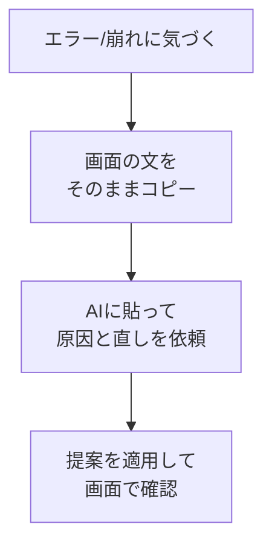

# エラーや表示崩れをAIに直してもらう

## たとえ話

> 組み立て家具を作っていると、途中で扉がうまく閉まらない、棚板が傾く、といった小さなつまずきが必ず起きる。経験のある人ほど、そこで慌てない。どこがどう噛み合っていないのかを一つずつ見て、説明書に戻り、ねじを締め直す。つまずきは失敗ではなく、完成へ向かう途中の当たり前の景色だと知っているからだ。

> ページづくりでも、エラーや表示崩れは必ず出る。赤い文字が並ぶと不安になるが、それは「ここが噛み合っていません」という案内にすぎない。大事なのは、その案内文をそのままAIに見せて、一緒に直すことだ。意味を自分で解読する必要はない。今日は、エラーや崩れに出会ったときの落ち着いた直し方を、手順として身につける。直せる、と思えると、作ることがぐっと怖くなくなる。

## 今日のゴール

エラーや表示崩れが出たとき、エラー文をAIに渡して直し、画面が正しく表示される状態に戻す。

## 前提確認

- すでにできる前提：第14章09でLPの初期形を作った、開発サーバーを起動できる
- まだ知らなくてよいこと：エラー文の意味を自分で読み解くこと

## このテーマで伸ばす力

**判断する力・相談する力** — つまずきを落ち着いて言葉にし、AIに直してもらう力です。

## 学びの段階

今日の完了条件は **「できる」** です。出ていたエラーや崩れが直り、画面が表示されればOKです。

## なぜ大事か

エラーは、作る人なら誰でも必ず出会います。怖いのは、エラーそのものより「どうしたらいいかわからない」という気持ちです。エラー文をそのままAIに渡す、という型を一つ持っておけば、たいていの場面で前に進めます。これは第14章だけでなく、これから先ずっと使える力です。

## 読んで学ぶ

### 直すときの基本の型



エラーには2種類あります。

- **エラー文が出る**：画面やターミナルに赤い文字が出る → 文をそのままコピーして渡す
- **表示が崩れる**：エラーは出ないが見た目が変 → 何がどう変かを言葉で伝える

**わからないまま進まないチェック**：赤い文字が怖い → 意味を読まなくてOK。コピーしてAIに渡すのが正解です。

## 手順

### ステップ1：エラー文をコピーする（5分）

エラーが出ている場所（ブラウザの画面、またはCursor下のターミナル）の文を、まるごと選択してコピーします。一部だけでなく、できるだけ全部を取ります。

> スクショ案内：エラーが出ている画面を1枚撮っておくと、Discord相談にも使えます。

### ステップ2：AIに原因と直しを頼む（10分）

Cursorのチャットに、コピーしたエラー文を貼って、次のように頼みます。

```text
次のエラーが出ています。原因をやさしく説明し、直してください。
コードの専門用語はできるだけ避けて説明してください。

（ここにエラー文を貼り付け）
```

表示崩れの場合は、エラー文の代わりに状態を言葉で伝えます。

```text
トップページの「料金」セクションだけ文字が重なって読めません。
重ならないように直してください。
```

### ステップ3：提案を確認してから適用する（10分）

AIが直しを提案したら、**すぐに「適用（Apply / Accept）」を押さず**、次を確認します。

- 変更対象が、エラーに関係しそうなファイルだけになっている
- 知らないファイルや、頼んでいない大量変更が含まれていない
- 削除が多い、設定ファイルが変わる、意味がわからない変更がある場合は押さない
- 判断できないときは、差分画面のスクショをDiscordへ送って確認する

問題なさそうなら **「適用（Apply / Accept）」** を押し、ブラウザの `localhost:3000` を再読み込みして確かめます。直っていなければ、もう一度「まだ〇〇です」と伝えます。1回で直らなくて当たり前です。

戻したいときは、保存前なら **Reject** を押します。適用後でも、すぐなら **Command + Z** で戻せることがあります。不安になったら保存せずに止まり、Discordで相談してください。

### ステップ4：直ったらメモを残す（5分）

同じエラーは後でまた出ることがあります。`~/Documents/Rebuild練習用/lp-site` の中に `troubleshoot.md` を作り、「どんなエラーが・どう直ったか」を1〜2行残しておきます。

## 15分版 / 30分版

- **15分版**：エラー文または崩れた状態をコピーし、AIかDiscordに貼れる形にできれば完了です。
- **30分版**：差分を確認してから Apply / Accept し、画面が戻ったところまで進みます。
- **今日はここで止まってOK**：AI編集が不安な場合は、エラー文・スクショ・「何をした直後か」の3点メモだけで完了です。手入力で直せそうな1行だけなら、自分で直してもOKです。

## できたらOK

- 出ていたエラーや崩れが直り、画面が正しく表示される
- 直し方を1つ、自分の言葉で説明できる

## つまずいたら

**躓いたら戻る先**：[09 AIに初期実装](./09-LP構成案を渡してAIに初期実装させる.md)

Discordで次のように聞いてください。

```text
【今やっている教材】第14章10 エラーを直す

【詰まったところ】（どんなエラーか）

【試したこと】（AIに何を頼んだか）

【スクショやエラー文】（文をそのまま貼る）

【どうなればOKか】
```

| つまずき | 対処 |
|---|---|
| 何度頼んでも直らない | 直前の変更を取り消し、1つ前の状態に戻してから再依頼 |
| エラー文が長い | 全部コピーしてOK。省略しない |
| 画面が真っ白 | ターミナルの赤い文をコピーしてAIへ |
| 知らないファイルが変わる | Apply / Accept を押さず、差分スクショをDiscordへ |
| 戻し方が不安 | Reject、Command + Z、保存前に止まる、の順に試す |

## 今日の成果物

- 直ったLP画面 ／ `lp-site/troubleshoot.md`（メモ）

## 問い

あなたはふだん、うまくいかないことに出会ったとき、**まず誰に・どう相談**しているでしょうか。  
「コピーして渡す」という型を持つと、つまずきへの怖さはどう変わるでしょうか。
