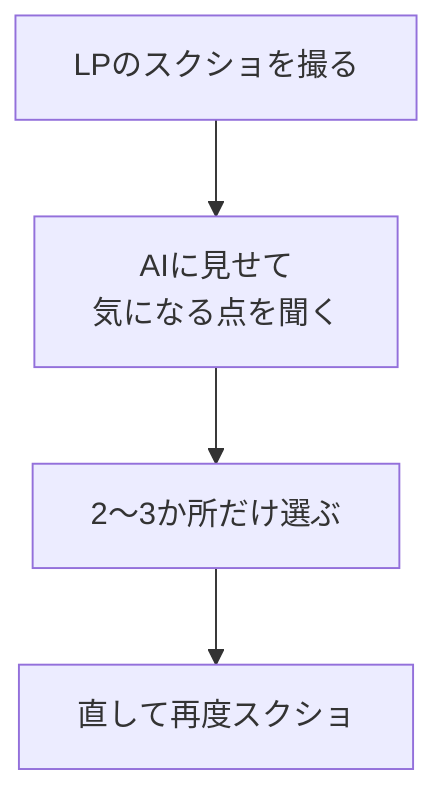

# スクショで見た目と文言を改善する

## たとえ話

> 部屋の模様替えをするとき、頭の中で考えているだけでは、なかなか良し悪しが決まらない。一度、一歩下がって全体を眺めると、「この棚は高すぎる」「ここは寂しい」と、ふしぎとよく見えてくる。離れて見る、という行為が、近くにいると気づけなかったことを教えてくれる。整えるとは、作ることと同じくらい「見ること」なのだ。

> ページを整えるときも、同じことが起きる。文字や色を直接いじる前に、まず画面を1枚の絵として見てみる。スクリーンショットを撮ってAIに見せると、「ここの余白が詰まっている」「見出しが弱い」と、人の目に近い指摘が返ってくる。今日は、できあがったLPを一歩引いて眺め、見た目と文言を少しだけ良くする。プロ級は目指さない。読みやすく、安心して読める一枚にするだけで十分だ。

## 今日のゴール

LPのスクショをAIに見せて、見た目（余白・見出し）と文言を2〜3か所だけ改善する。

## 前提確認

- すでにできる前提：第14章10までで、LPが崩れずに表示されている
- まだ知らなくてよいこと：デザインの専門用語、配色理論

## このテーマで伸ばす力

**整える力・判断する力** — 一歩引いて見て、直す場所を選ぶ力です。

## 学びの段階

今日の完了条件は **「できる」** です。改善前と後で、2〜3か所が良くなっていればOKです。

## なぜ大事か

LPは「読みやすさ」で印象が大きく変わります。とはいえ、全部を直そうとすると終わりません。今日は「2〜3か所だけ」と決めて整えます。スクショを使うと、AIに状況を正確に伝えられ、人の目に近い改善が返ってきます。完璧でなくてよい、を忘れずに。

## 読んで学ぶ

### 直す前に「見る」



改善は欲張らないのがコツです。「余白」「見出しの大きさ」「言葉の言い回し」あたりが、初めてでも効果が出やすい場所です。

**わからないまま進まないチェック**：どこを直すか決められない → AIの指摘の中から、上から2つだけ選べばOKです。

## 手順

### ステップ1：LPのスクショを撮る（5分）

ブラウザで `localhost:3000` を開き、ページ全体のスクリーンショットを撮ります。Macなら **Shift + Command + 4** で範囲を選んで撮れます。

> スクショ案内：改善前の状態として、ページ全体のスクショを1枚保存しておきます。後で見比べられます。

### ステップ2：AIに見せて指摘をもらう（10分）

Cursorのチャットに、撮ったスクショをドラッグして添付し、次のように頼みます。

```text
このLPのスクショを見て、読みやすくするために
直すとよい点を3つだけ、やさしい言葉で挙げてください。
派手なデザインではなく、落ち着いて読みやすい方向でお願いします。
```

### ステップ3：2〜3か所だけ直してもらう（10分）

指摘の中から2〜3つ選び、AIに直しを頼みます。

```text
さきほどの指摘のうち、次の2つだけ直してください。
1. 見出しと本文の余白を少し広げる
2. ヒーローの見出しをもう少し大きく
他の部分は変えないでください。
```

AIが変更を提案したら、Apply / Accept の前に次を確認します。

- 変更対象が見た目や文言に関係するファイルだけになっている
- 知らないファイルや、頼んでいない設定ファイルが含まれていない
- 2〜3か所以外を大きく作り替えていない
- 判断できないときは、差分スクショをDiscordへ送って確認する

問題なさそうなら適用し、ブラウザを再読み込みして確認します。

### ステップ4：改善前後を見比べる（5分）

改善後のスクショをもう1枚撮り、ステップ1のものと並べて見比べます。良くなっていれば完了です。やり過ぎたと感じたら、AIに「1つ前に戻して」と頼みます。保存前なら **Reject**、適用直後なら **Command + Z** で戻せることがあります。不安なら保存せずに止まってください。

## 15分版 / 30分版

- **15分版**：スクショを撮り、改善点を3つだけメモできれば完了です。AI編集まで進まなくてOKです。
- **30分版**：2か所だけ改善し、改善前後のスクショを残せれば完了です。
- **今日はここで止まってOK**：AI編集がうまくいかない場合は、「直したい改善点3つ」だけを書いて終わります。次回、手入力かDiscord相談で進めます。

## できたらOK

- 見た目または文言が2〜3か所、改善されている
- 改善前後のスクショがある

## つまずいたら

**躓いたら戻る先**：[10 エラーを直す](./10-エラーや表示崩れをAIに直してもらう.md)

Discordで次のように聞いてください。

```text
【今やっている教材】第14章11 見た目の改善

【詰まったところ】

【試したこと】

【スクショやエラー文】（改善前後の画像）

【どうなればOKか】
```

| つまずき | 対処 |
|---|---|
| 直すほど悪くなる | 「1つ前に戻して」と頼み、欲張らず2か所まで |
| スクショを添付できない | 画像ファイルをチャット欄にドラッグして入れる |
| 指摘が多すぎる | 上から2つだけに絞る |
| 知らないファイルが変わる | Apply / Accept を押さず、差分スクショをDiscordへ |
| 戻したい | Reject、Command + Z、保存前に止まる、の順に試す |

## 今日の成果物

- 改善後のLP ／ 改善前後のスクショ

## 問い

あなたの仕事の成果物を、**一歩引いて客観的に見る時間**を、ふだん取れているでしょうか。  
「見る」を増やすと、「直す」はどう変わっていくでしょうか。
