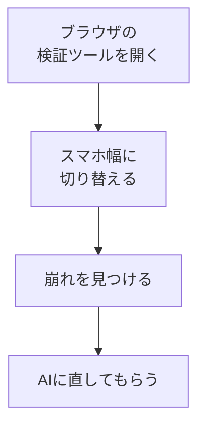

# スマホ表示を確認する

## たとえ話

> ある料理を、大きな皿に盛りつけて満足していたら、いざ小さなお弁当箱に詰め直したとき、収まりきらず形が崩れてしまう。同じ料理でも、入れる器が変われば見え方は大きく変わる。器に合わせて整え直して、はじめて「どこで出しても大丈夫」と言える。作り手の都合ではなく、受け取る側の器に合わせる。それが、相手に届く整え方だ。

> ページも同じで、作る人はたいてい大きなパソコン画面で確認している。けれど、実際に見る人の多くは、手のひらの小さな画面で開く。パソコンでは整って見えても、スマホでは文字がはみ出したり、ボタンが押しにくかったりすることがある。だから公開の前に、必ず小さな画面でも確かめる。今日は、自分のLPをスマホの幅で見て、崩れていたらAIに整えてもらう。届く相手の器に合わせる、最後のひと手間だ。

## 今日のゴール

LPをスマホの幅で確認し、崩れている箇所があればAIに直してもらう。

## 前提確認

- すでにできる前提：第14章11までで、パソコン画面のLPが整っている
- まだ知らなくてよいこと：レスポンシブ対応の専門用語

## このテーマで伸ばす力

**判断する力・整える力** — 受け取る相手の環境を想像し、確かめる力です。

## 学びの段階

今日の完了条件は **「できる」** です。スマホ幅で大きな崩れがない状態になればOKです。

## なぜ大事か

LPを見る人の多くは、スマートフォンで開きます。パソコンだけで確認して公開すると、いちばん大事な「お客さまの画面」で崩れていた、ということが起きます。公開の直前に小さな画面で確かめるだけで、この事故をほぼ防げます。

## 読んで学ぶ

### パソコンの中でスマホ幅を再現できる



実機のスマホがなくても、パソコンのブラウザでスマホ幅を再現できます。もちろん、手元のスマホで実際に開いて確認してもかまいません。

**わからないまま進まないチェック**：実機がなくて不安 → ブラウザの検証ツールで十分確認できます。

## 手順

### ステップ1：ブラウザでスマホ幅にする（5分）

`localhost:3000` を開いた状態で、ページ上で右クリック →「検証（Inspect）」を選びます。開いたパネルの上にある **スマホとタブレットのアイコン**（デバイスツールバー）を押すと、画面がスマホ幅になります。

> スクショ案内：スマホ幅で表示されたLP全体を1枚撮っておきます。

### ステップ2：崩れを探す（5分）

上から順に見て、次のような崩れがないか確認します。

- 文字が画面からはみ出している
- ボタンが小さすぎて押しにくい
- 画像が大きすぎる／横スクロールが出る
- 文字どうしが重なっている

気づいた点を、1〜3個メモします。

### ステップ3：AIに直してもらう（10分）

崩れのスクショをチャットに添付し、次のように頼みます。

```text
このスクショはスマホ幅で見たLPです。
スマホでも崩れず読みやすくなるよう直してください。
パソコン表示は崩さないようにしてください。
直した箇所を一言で教えてください。
```

AIが変更を提案したら、Apply / Accept の前に次を確認します。

- 変更対象がスマホ表示に関係しそうなファイルだけになっている
- 知らないファイルや、頼んでいない設定ファイルが含まれていない
- パソコン表示を大きく壊しそうな変更ではない
- 判断できないときは、差分スクショをDiscordへ送って確認する

問題なさそうなら適用し、もう一度スマホ幅で再読み込みして確認します。

### ステップ4：可能なら実機でも見る（5分）

時間があれば、手元のスマホで確認する準備として、今日は「スマホでも崩れない状態」を作れていれば十分です。実機での確認は、公開後（第14章15）にもできます。

## 15分版 / 30分版

- **15分版**：スマホ幅で表示し、崩れを1〜3個メモできれば完了です。AI編集まで進まなくてOKです。
- **30分版**：差分を確認してから Apply / Accept し、スマホ幅で大きな崩れがないところまで進みます。
- **今日はここで止まってOK**：AI編集がうまくいかない場合は、スマホ幅スクショと「直したい点3つ」だけで完了です。

## できたらOK

- スマホ幅で大きな崩れがない
- スマホ幅のスクショがある

## つまずいたら

**躓いたら戻る先**：[11 見た目の改善](./11-スクショで見た目と文言を改善する.md)

Discordで次のように聞いてください。

```text
【今やっている教材】第14章12 スマホ表示

【詰まったところ】

【試したこと】

【スクショやエラー文】（スマホ幅の画像）

【どうなればOKか】
```

| つまずき | 対処 |
|---|---|
| 検証ツールの開き方がわからない | キーボードの F12、または右クリック→検証 |
| 直すとパソコン表示が崩れる | 「パソコン表示は崩さないで」と必ず添える |
| 横スクロールが消えない | 「横スクロールをなくして」と具体的に依頼 |
| 知らないファイルが変わる | Apply / Accept を押さず、差分スクショをDiscordへ |
| AI編集が使えない | スマホ幅スクショと改善点メモだけで完了 |

## 今日の成果物

- スマホ幅で整ったLP ／ スマホ幅のスクショ

## 問い

あなたのサービスのお客さまは、ふだん**どの画面**であなたの情報を見ているでしょうか。  
相手の器に合わせて確かめることは、信頼にどうつながるでしょうか。
