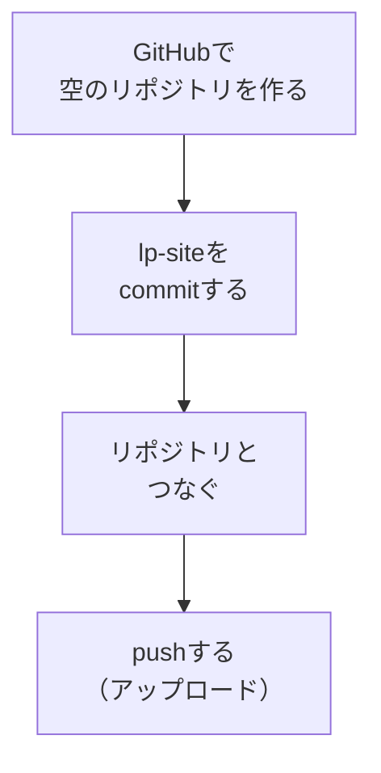

# GitHubにpushする

## たとえ話

> 大切な書類を、机の上にだけ置いておく人は少ない。万一の水こぼしや紛失に備えて、鍵のかかる棚や、別の場所にも控えを置く。控えがあると安心して作業できるし、いざというとき元に戻せる。さらに、信頼できる場所に預けておけば、必要なときに別の人や別の機械からも取り出せる。保管とは、ただしまうことではなく「いつでも取り出せる状態にする」ことだ。

> 作ったLPも、自分のパソコンの中にあるだけでは、まだ世界とつながっていない。そこで、できあがったものを信頼できる保管場所に預ける。それがGitHubだ。第10章で一度触れた、変更を記録し、ネット上に置いておく仕組みである。ここに預けておくと、次のテーマで公開サービスとつなぐだけで、世界に届く一枚になる。今日は、LPをGitHubに置くところまで進める。公開の一歩手前、いちばん大事な橋渡しだ。

## 今日のゴール

`lp-site` をGitHubの新しいリポジトリにpush（アップロード）する。
作業は必ず `~/Documents/Rebuild練習用/lp-site` の中だけで行います。

## 前提確認

- すでにできる前提：第10章でGitHubアカウントを作り、git の基本（add/commit）を触った
- まだ知らなくてよいこと：gitの高度なコマンド、ブランチ運用

## このテーマで伸ばす力

**整える力・進める力** — 成果物を安全に保管し、公開へつなぐ力です。

## 学びの段階

今日の完了条件は **「できる」** です。GitHub上に `lp-site` のコードが並べばOKです。

## なぜ大事か

次のテーマ（Netlify公開）は、GitHubに置いたコードを読み込んで世界に出します。つまり、GitHubへのpushが公開の土台になります。同時に、これはあなたの作品の「控え」にもなります。パソコンが壊れても、ここに残ります。

## 読んで学ぶ

### 今日の流れ



`create-next-app` で作ったプロジェクトは、最初からgitの記録が始まっていることが多いです。迷ったらAIに状態を聞けば教えてくれます。

**わからないまま進まないチェック**：gitが不安 → 第10章の復習です。コマンドは1行ずつ貼ればOKです。

## 手順

### ステップ1：GitHubで空のリポジトリを作る（5分）

ブラウザで [github.com](https://github.com) にログインし、右上の **「+」→「New repository」** を押します。

- Repository name：`lp-site`
- 公開範囲：**Private**（まずは非公開で安心して進めます）
- そのほかは初期のまま、**「Create repository」** を押します

> スクショ案内：作成後に出る「…or push an existing repository」のコマンド画面を1枚撮っておきます。後で使います。

### ステップ2：変更をcommitする（5分）

Cursor下のターミナルで、`lp-site` にいることを確認し、次を順に実行します。

```bash
pwd
ls
```

`pwd` に `/Documents/Rebuild練習用/lp-site` が含まれ、`ls` に `package.json` が見えればOKです。違う場所なら、この先のgitコマンドは実行しないでください。

push前に、公開してよい情報だけか確認します。

- 実名を公開してよいか
- 住所の詳細が入っていないか
- 電話番号を公開してよいか
- 問い合わせ先メールやフォームが正しいか
- 料金を公開してよいか
- パスワード、APIキー、秘密のメモが入っていないか

不安な項目が1つでもあれば、commitやpushの前に止まり、Discordで確認してください。

```bash
git add .
git commit -m "LP初期版"
```

「nothing to commit」と出たら、すでに記録済みなので次へ進みます。

### ステップ3：GitHubのリポジトリとつなぐ（5分）

まず、すでに接続先が登録されていないか確認します。

```bash
git remote -v
```

何も表示されなければ、ステップ1の画面に出ていたコマンドをコピーして実行します。形は次のようになっています（`あなたの名前` の部分は自分のものに変わっています）。

```bash
git remote add origin https://github.com/あなたの名前/lp-site.git
git branch -M main
```

`git remote -v` で、すでに別のURLが表示された場合は、すぐに `git remote add` を実行しないでください。教材の `lp-site` の中にいることをもう一度 `pwd` で確認し、迷ったらDiscordで相談します。

`remote origin already exists` と出た場合だけ、次を検討します。実行前に必ず `git remote -v` の結果を確認してください。

```bash
git remote -v
git remote remove origin
```

この操作は接続先を外す操作です。`~/Documents/Rebuild練習用/lp-site` 以外では実行しません。不安ならここで止まり、Discordにスクショを送ってください。

### ステップ4：pushする（10分）

```bash
git push -u origin main
```

途中でGitHubのログインを求められたら、画面の案内にそって進めます（ブラウザでの認証が開くことがあります）。

> スクショ案内：push成功後、GitHubのリポジトリページを再読み込みして、ファイルが並んだ画面を1枚撮っておきます。

### ステップ5：確認する（2分）

GitHubの `lp-site` ページを開き、`app` や `package.json` などのファイルが表示されていれば成功です。

## 15分版 / 30分版

- **15分版**：`pwd` / `ls` で場所を確認し、公開情報チェックをしたうえで `git commit` までできれば完了です。GitHub認証で止まってもOKです。
- **30分版**：GitHubに `lp-site` リポジトリを作り、pushしてファイル一覧を確認できれば完了です。
- **今日はここで止まってOK**：認証、remote設定、公開情報のどれかで不安になったら、先に進まずスクショをDiscordへ。commitまでできていれば十分な成果です。

## できたらOK

- GitHubに `lp-site` リポジトリができている
- その中にプロジェクトのファイルが並んでいる

## つまずいたら

**躓いたら戻る先**：[第10章 status/add/commit](../第10章-GitとGitHub/03-git-status-add-commit.md) ／ [第10章 リポジトリ作成とpush](../第10章-GitとGitHub/04-リポジトリを作ってpushする.md)

Discordで次のように聞いてください。

```text
【今やっている教材】第14章13 GitHubにpush

【詰まったところ】（どのコマンドで止まったか）

【試したこと】

【スクショやエラー文】（画面の文をそのまま）

【どうなればOKか】
```

| つまずき | 対処 |
|---|---|
| `remote origin already exists` | `git remote -v` でURLを確認。削除が必要か迷ったらDiscordへ |
| 認証で止まる | 画面の案内にそってブラウザで認証 |
| push が拒否される | エラー文をコピーしてAI・Discordへ |
| remote のURLが違う気がする | `git remote -v` の結果を確認し、削除前にDiscordへ |
| 公開情報が不安 | pushせず、該当箇所を伏せたスクショで相談 |

## 今日の成果物

- GitHub上の `lp-site` リポジトリ

## 問い

あなたの仕事の大切なものに、**「控え」や「預け先」**は用意できているでしょうか。  
いつでも取り出せる状態は、心の余裕にどうつながるでしょうか。
