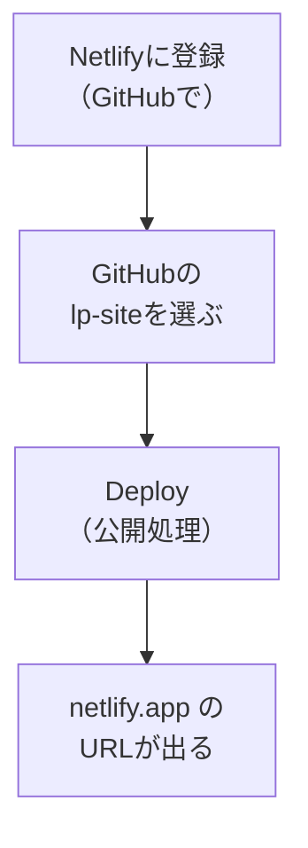

# Netlifyで公開する

## たとえ話

> 丹精込めて育てたものを、自分の家の中だけで眺めているうちは、まだ誰の役にも立っていない。市場に並べてはじめて、必要としていた人の手に届く。並べる場所さえ用意できれば、あとは訪れた人がいつでも受け取れる。作ることと、届けることは、別の一歩だ。多くの人は、この「並べる」一歩の前で立ち止まってしまう。

> ここまで作ってきたLPも、自分のパソコンとGitHubの中にあるだけでは、まだ誰も見られない。これを世界から見られる場所に「並べる」のが、今日のNetlify（ネットリファイ）だ。GitHubに預けたコードを読み込み、誰でも開けるURLに変えてくれる無料のサービスである。難しい設定はほとんどいらない。今日は、長く準備してきた一枚に、ついに住所を与える。第14章の到達点、公開そのものだ。

## 今日のゴール

NetlifyとGitHubをつなぎ、`lp-site` を公開して、開けるURLを手に入れる。

## 前提確認

- すでにできる前提：第14章13で `lp-site` をGitHubにpushした
- まだ知らなくてよいこと：独自ドメイン、サーバーの細かい設定

## このテーマで伸ばす力

**進める力・作る力** — 作ったものを世界に届ける、最後の一歩を踏み出す力です。

## 学びの段階

今日の完了条件は **「できる」** です。`〜.netlify.app` のURLでLPが開ければOKです。

## なぜ大事か

これが第14章、そして初期必修の到達点のひとつです。「作れた」だけでなく「公開できた」に届きます。一度この経験をすると、次からは更新も同じ流れでできます。プロ級でなくてかまいません。世界から見られる一枚があること自体に、大きな意味があります。

## 読んで学ぶ

### 今日の流れ



Netlifyは、GitHubのコードを読み込んで自動でビルド（公開用に組み立て）してくれます。Next.jsの場合、設定は自動で見つけてくれることが多いです。

**わからないまま進まないチェック**：設定が不安 → 公開前チェックをしてから、迷った設定は推奨のまま進めます。不安ならDeployを押す前にDiscordで止まってください。

## 手順

### ステップ1：Netlifyに登録する（5分）

ブラウザで [netlify.com](https://www.netlify.com) を開き、**「Sign up」** を押します。**「Sign up with GitHub」** を選ぶと、第13章で使ったGitHubアカウントでそのまま登録できます。

### ステップ2：新しいサイトを作る（5分）

ログイン後、**「Add new site」→「Import an existing project」** を押します。**「Deploy with GitHub」** を選び、求められたらNetlifyにGitHubへのアクセスを許可します。

> スクショ案内：リポジトリ一覧が出た画面を1枚撮っておきます。

### ステップ3：lp-site を選ぶ（5分）

リポジトリ一覧から `lp-site` を選びます。次の設定画面では、Next.jsが自動で認識され、ビルド設定が入っていることが多いです。**そのまま（推奨のまま）** で進めて大丈夫です。

### ステップ3.5：公開前チェックをする（5分）

Deployを押す前に、公開してよい内容か確認します。1つでも不安があれば、Deployを押さずにDiscordで相談してください。

- 実名を公開してよいか
- 住所の詳細が入っていないか
- 電話番号を公開してよいか
- 問い合わせ先メールやフォームが正しいか
- 料金を公開してよいか
- お客さまの名前、やりとりの記録、秘密情報が入っていないか
- GitHubリポジトリが意図どおり `lp-site` になっているか

### ステップ4：Deploy（公開）する（10分）

画面の **「Deploy」**（または「Deploy site」）ボタンを押します。公開処理が始まり、数分待ちます。完了すると、`https://〜.netlify.app` という形のURLが表示されます。

> スクショ案内：「Published」やURLが表示された画面を1枚撮っておきます。

### ステップ5：URLを開いて確認する（3分）

表示された `netlify.app` のURLをクリックします。あなたのLPが、世界から見られる形で表示されれば、公開成功です。

## 15分版 / 30分版

- **15分版**：Netlifyにログインし、GitHub連携または公開前チェックまで進めば完了です。認証で止まってもOKです。
- **30分版**：Deployを押し、`〜.netlify.app` のURLを開ければ完了です。
- **今日はここで止まってOK**：Netlify連携、GitHub認証、Deploy設定で止まった場合は、止まった画面のスクショとエラー文をDiscordへ送れる形にして完了です。公開ボタンを無理に押さなくて大丈夫です。

## できたらOK

- `〜.netlify.app` のURLでLPが開ける
- パソコン以外（スマホなど）からも開ける

## つまずいたら

**躓いたら戻る先**：[13 GitHubにpush](./13-GitHubにpushする.md)

Discordで次のように聞いてください。

```text
【今やっている教材】第14章14 Netlify公開

【詰まったところ】（どの画面で止まったか）

【試したこと】

【スクショやエラー文】（Deployログの赤い文など）

【どうなればOKか】
```

| つまずき | 対処 |
|---|---|
| Deployが失敗（Failed） | ログの赤い文をコピーしてAI・Discordへ |
| リポジトリが一覧に出ない | Netlifyへのアクセス許可（GitHub側）を確認 |
| Privateで見つからない | アクセス許可の対象に `lp-site` を含める |
| GitHub認証で止まる | 認証画面のスクショを撮り、今日は連携確認まででOK |
| 公開前チェックで不安がある | Deployを押さずにDiscordで確認 |

## 今日の成果物

- 公開されたLPのURL（`〜.netlify.app`）

## 問い

あなたがこれまで「作ったけれど出せていないもの」は、何かあるでしょうか。  
「届ける」最後の一歩を踏み出せたいま、次は何を世に出してみたいでしょうか。
