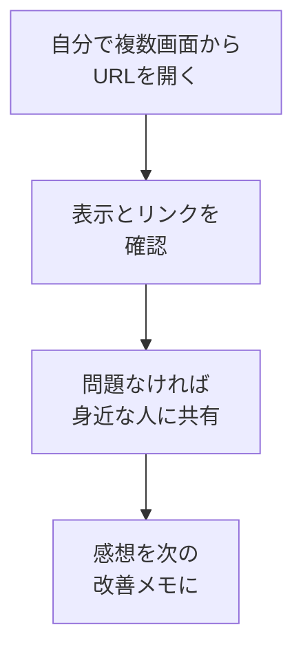

# 公開URLを確認し、必要に応じて共有する

## たとえ話

> 新しいお店の準備が整っても、開店初日にいきなり大勢を呼び込む人は少ない。まず自分で入口から入り、看板は読めるか、椅子はぐらつかないかを確かめる。それから、近しい人を少しだけ招いて感想を聞く。一度に全部を背負わず、小さく確かめてから広げていく。最初の一歩は、大きく踏み出すより、確かに踏み出すほうがいい。

> 公開できたLPも、これと同じだ。URLが手に入った今、まずは自分でいくつかの画面から開いて、ちゃんと表示されるか、リンクは動くかを確かめる。それができたら、信頼できる相手にひとりふたり見てもらい、感想をもらう。いきなり大々的に広めなくていい。今日は、公開したURLを落ち着いて確認し、必要なら身近なところから共有してみる。第14章の締めくくり、そしてここからの始まりだ。

## 今日のゴール

公開URLを複数の画面で確認し、問題がなければ、必要に応じて身近な相手に共有する。

## 前提確認

- すでにできる前提：第14章14でNetlifyの公開URLを手に入れた
- まだ知らなくてよいこと：アクセス解析、広告、SEOの専門的な施策

## このテーマで伸ばす力

**続ける力・相談する力** — 公開後に確かめ、感想を受け取り、次へつなぐ力です。

## 学びの段階

今日の完了条件は **「できる」** です。URLの動作を確認し、共有の方針を決められればOKです。

## なぜ大事か

公開はゴールであり、同時にスタートです。まず自分で確かめておくと、人に見せたときの不安が減ります。そして、少人数の感想は、次の改善のいちばんよい材料になります。一気に広めるより、小さく確かめて整える。この回し方を身につけると、LPは「作って終わり」になりません。

## 読んで学ぶ

### 確認してから、小さく共有する



共有は義務ではありません。まだ整えたい人は、自分で確認するところまでで十分です。準備ができたときに、いつでも共有できます。

**わからないまま進まないチェック**：まだ人に見せる自信がない → 今日は自分で確認するだけでもOKです。

## 手順

### ステップ1：自分で複数の画面から開く（10分）

公開URL（`〜.netlify.app`）を、次のように複数の環境で開いて確認します。

- パソコンのブラウザ
- 手元のスマートフォン
- できれば別のブラウザ（SafariとChromeなど）

確認する点：

- 上から下まで崩れずに表示されるか
- 問い合わせのボタンやリンクが正しく動くか
- 文章に事実と違う点・誤字がないか

共有前に、機密・個人情報も確認します。

- 実名を出す必要がある場合だけ出しているか
- 住所の詳細、個人の電話番号を不用意に出していないか
- 問い合わせ先が公開してよい連絡先になっているか
- 料金や条件に誤解を招く表現がないか
- お客さまの名前、やりとりの記録、秘密情報が入っていないか
- NetlifyやGitHubの管理画面ではなく、公開URLだけを共有しているか

> スクショ案内：スマホで開いたLPを1枚撮っておくと、公開の記念にも記録にもなります。

### ステップ2：気になる点をメモする（5分）

直したい点があれば、`~/Documents/Rebuild練習用/lp-site` の `improve-next.md` に箇条書きで残します。今日すべて直す必要はありません。次の更新のための一覧にします。

### ステップ3：必要に応じて共有する（10分）

確認できたら、信頼できる相手にひとり〜数人、URLを送って感想をもらいます。聞き方の例：

```text
小さなLPを公開してみました。
スマホで開いて、わかりにくい所が1つだけあれば教えてください。
```

Rebuild AI Guild の Discord で共有して、仲間から感想をもらうのもおすすめです。

スクショを共有するときは、次を目安にしてください。

- **隠すもの**：NetlifyやGitHubの管理画面、メールアドレス、電話番号、住所詳細、ログイン中のアカウント名、Deployログの秘密っぽい文字列
- **隠さなくてよいもの**：公開URL、LPの見た目、公開する前提のサービス説明、見出し、一般的な料金表示
- 迷ったら隠してから共有します。不安ならDiscordで「これは隠した方がいいですか」と聞いてOKです。

### ステップ4：更新の仕方を確認しておく（5分）

今後、文章を直したいときは、`lp-site` を編集 → `git add . && git commit -m "更新" && git push` するだけで、Netlifyが自動で公開し直してくれます。この流れを1行メモしておくと、次から迷いません。

## 15分版 / 30分版

- **15分版**：公開URLを自分のパソコンかスマホで開き、共有前チェックリストを確認できれば完了です。共有しなくてもOKです。
- **30分版**：複数画面で確認し、必要なら1人またはDiscordに共有して感想をもらう準備まで進みます。
- **今日はここで止まってOK**：URLが開けない、共有が不安、スクショで隠す場所がわからない場合は、共有せずにチェックメモだけ作って完了です。

## できたらOK

- 公開URLが複数の画面で正しく開ける
- 共有するか／もう少し整えるかの方針を決めた

## つまずいたら

**躓いたら戻る先**：[14 Netlifyで公開する](./14-Netlifyで公開する.md)

Discordで次のように聞いてください。

```text
【今やっている教材】第14章15 URLの確認と共有

【詰まったところ】

【試したこと】

【スクショやエラー文】

【どうなればOKか】
```

| つまずき | 対処 |
|---|---|
| スマホで開けない | URLのつづりを確認。少し待って再読み込み |
| 直したのに反映されない | push したか確認。Netlifyの公開完了を待つ |
| 共有がこわい | 今日は自分の確認だけでOK。共有は後日でよい |
| スクショで何を隠すかわからない | 管理画面・連絡先・住所詳細を隠し、迷ったらDiscordへ |
| 認証や管理画面で止まる | 公開URL確認まででOK。管理画面の操作は次回に回す |

## 今日の成果物

- 確認済みの公開URL ／ `lp-site/improve-next.md`（次の改善メモ）

## 問い

ここまで作って公開できたいま、あなたの中で**いちばん変わった感覚**は何でしょうか。  
この一枚を入口に、次はどんな小さな一歩を踏み出してみたいでしょうか。
